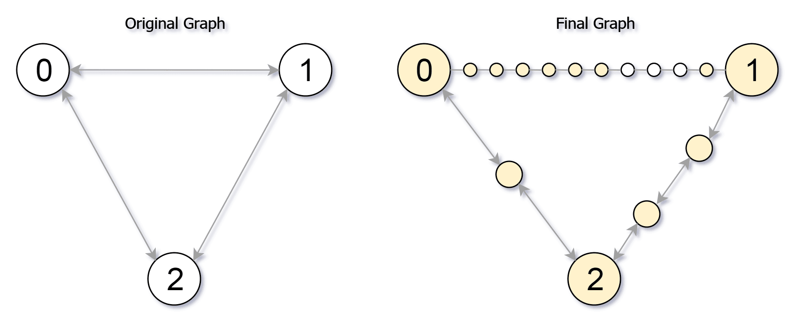

# [882. 细分图中的可到达结点](https://leetcode-cn.com/problems/reachable-nodes-in-subdivided-graph)

[English Version](/solution/0800-0899/0882.Reachable%20Nodes%20In%20Subdivided%20Graph/README_EN.md)

## 题目描述
<!-- 这里写题目描述 -->
<p>从具有&nbsp;<code>0</code> 到 <code>N-1</code> 的结点的<strong>无向</strong>图（&ldquo;原始图&rdquo;）开始，对一些边进行细分。</p>

<p>该图给出如下：<code>edges[k]</code>&nbsp;是整数对&nbsp;<code>(i, j, n)</code>&nbsp;组成的列表，使&nbsp;<code>(i, j)</code> 是原始图的边。</p>

<p><code>n</code> 是该边上<strong>新</strong>结点的总数</p>

<p>然后，将边&nbsp;<code>(i, j)</code>&nbsp;从原始图中删除，将&nbsp;<code>n</code>&nbsp;个新结点&nbsp;<code>(x_1, x_2, ..., x_n)</code>&nbsp;添加到原始图中，</p>

<p>将&nbsp;<code>n+1</code>&nbsp;条新边&nbsp;<code>(i, x_1), (x_1, x_2), (x_2, x_3), ..., (x_{n-1}, x_n), (x_n, j)</code>&nbsp;添加到原始图中。</p>

<p>现在，你将从原始图中的结点&nbsp;<code>0</code>&nbsp;处出发，并且每次移动，你都将沿着一条边行进。</p>

<p>返回最多 <code>M</code> 次移动可以达到的结点数。</p>

<p>&nbsp;</p>

<p><strong>示例 1：</strong></p>

<pre><strong>输入：</strong><code>edges </code>= [[0,1,10],[0,2,1],[1,2,2]], M = 6, N = 3
<strong>输出：</strong>13
<strong>解释：</strong>
在 M = 6 次移动之后在最终图中可到达的结点如下所示。
</pre>



<p><strong>示例 2：</strong></p>

<pre><strong>输入：</strong><code>edges </code>= [[0,1,4],[1,2,6],[0,2,8],[1,3,1]], M = 10, N = 4
<strong>输出：</strong>23</pre>

<p>&nbsp;</p>

<p><strong>提示：</strong></p>

<ol>
	<li><code>0 &lt;= edges.length &lt;= 10000</code></li>
	<li><code>0 &lt;= edges[i][0] &lt;&nbsp;edges[i][1] &lt; N</code></li>
	<li>不存在任何&nbsp;<code>i != j</code>&nbsp;情况下&nbsp;<code>edges[i][0] == edges[j][0]</code>&nbsp;且&nbsp;<code>edges[i][1] == edges[j][1]</code>.</li>
	<li>原始图没有平行的边。</li>
	<li><code>0 &lt;= edges[i][2] &lt;= 10000</code></li>
	<li><code>0 &lt;= M &lt;= 10^9</code></li>
	<li><code>1 &lt;= N &lt;= 3000</code></li>
	<li>可到达结点是可以从结点 <code>0</code> 开始使用最多 <code>M</code> 次移动到达的结点。</li>
</ol>

<p>&nbsp;</p>


## 解法
<!-- 这里可写通用的实现逻辑 -->


<!-- tabs:start -->

### **Python3**
<!-- 这里可写当前语言的特殊实现逻辑 -->

```python

```

### **Java**
<!-- 这里可写当前语言的特殊实现逻辑 -->

```java

```

### **...**
```

```

<!-- tabs:end -->