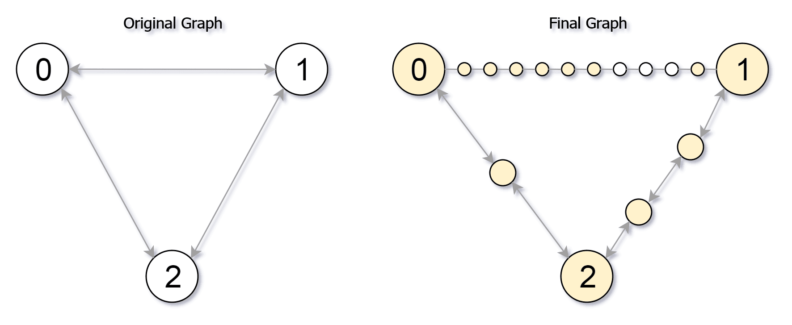

# [882. Reachable Nodes In Subdivided Graph](https://leetcode.com/problems/reachable-nodes-in-subdivided-graph)

[中文文档](/solution/0800-0899/0882.Reachable%20Nodes%20In%20Subdivided%20Graph/README.md)

## Description
<p>Starting with an&nbsp;<strong>undirected</strong> graph (the &quot;original graph&quot;) with nodes from <code>0</code> to <code>N-1</code>, subdivisions are made to some of the edges.</p>


<p>The graph is given as follows: <code>edges[k]</code> is a list of integer pairs <code>(i, j, n)</code> such that <code>(i, j)</code> is an edge of the original graph,</p>


<p>and <code>n</code> is the total number of <strong>new</strong> nodes on that edge.&nbsp;</p>


<p>Then, the edge <code>(i, j)</code> is deleted from the original graph,&nbsp;<code>n</code>&nbsp;new nodes <code>(x_1, x_2, ..., x_n)</code> are added to the original graph,</p>


<p>and <code>n+1</code> new&nbsp;edges <code>(i, x_1), (x_1, x_2), (x_2, x_3), ..., (x_{n-1}, x_n), (x_n, j)</code>&nbsp;are added to the original&nbsp;graph.</p>


<p>Now, you start at node <code>0</code>&nbsp;from the original graph, and in each move, you travel along one&nbsp;edge.&nbsp;</p>


<p>Return how many nodes you can reach in at most <code>M</code> moves.</p>


<p>&nbsp;</p>


<p><strong>Example 1:</strong></p>


<pre>

<strong>Input: </strong><code>edges </code>= <span id="example-input-1-1">[[0,1,10],[0,2,1],[1,2,2]]</span>, M = <span id="example-input-1-2">6</span>, N = <span id="example-input-1-3">3</span>

<strong>Output: </strong><span id="example-output-1">13</span>

<strong>Explanation: </strong>

The nodes that are reachable in the final graph after M = 6 moves are indicated below.

</pre>



<div>

<p><strong>Example 2:</strong></p>


<pre>

<strong>Input: </strong><code>edges </code>= <span id="example-input-2-1">[[0,1,4],[1,2,6],[0,2,8],[1,3,1]]</span>, M = <span id="example-input-2-2">10</span>, N = <span id="example-input-2-3">4</span>

<strong>Output: </strong><span id="example-output-2">23</span></pre>


<p>&nbsp;</p>

</div>


<p><strong>Note:</strong></p>


<ol>
	<li><code>0 &lt;= edges.length &lt;= 10000</code></li>
	<li><code>0 &lt;= edges[i][0] &lt;&nbsp;edges[i][1] &lt; N</code></li>
	<li>There does not exist any&nbsp;<code>i != j</code> for which <code>edges[i][0] == edges[j][0]</code> and <code>edges[i][1] == edges[j][1]</code>.</li>
	<li>The original graph&nbsp;has no parallel edges.</li>
	<li><code>0 &lt;= edges[i][2] &lt;= 10000</code></li>
	<li><code>0 &lt;= M &lt;= 10^9</code></li>
	<li><code><font face="monospace">1 &lt;= N &lt;= 3000</font></code></li>
	<li>A reachable node is a node that can be travelled to&nbsp;using at most&nbsp;M moves starting from&nbsp;node 0.</li>
</ol>


<div>

<div>&nbsp;</div>

</div>


## Solutions


<!-- tabs:start -->

### **Python3**

```python

```

### **Java**

```java

```

### **...**
```

```

<!-- tabs:end -->