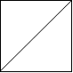
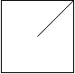
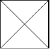
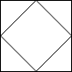
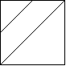

# [959. Regions Cut By Slashes](https://leetcode.com/problems/regions-cut-by-slashes)

[中文文档](/solution/0900-0999/0959.Regions%20Cut%20By%20Slashes/README.md)

## Description
<p>In a N x N&nbsp;<code>grid</code> composed of 1 x 1 squares, each 1 x 1 square consists of a <code>/</code>, <code>\</code>, or blank space.&nbsp; These characters divide the square into contiguous regions.</p>


<p>(Note that backslash characters are escaped, so a <code>\</code>&nbsp;is represented as <code>&quot;\\&quot;</code>.)</p>


<p>Return the number of regions.</p>


<p>&nbsp;</p>


<div>

<div>

<div>

<div>

<div>

<ol>

</ol>

</div>

</div>

</div>

</div>

</div>


<div>

<p><strong>Example 1:</strong></p>


<pre>

<strong>Input:

</strong><span id="example-input-1-1">[

&nbsp; &quot; /&quot;,

&nbsp; &quot;/ &quot;

]</span>

<strong>Output: </strong><span id="example-output-1">2</span>

<strong>Explanation: </strong>The 2x2 grid is as follows:

</pre>



<div>

<p><strong>Example 2:</strong></p>


<pre>

<strong>Input:

</strong><span id="example-input-2-1">[

&nbsp; &quot; /&quot;,

&nbsp; &quot;  &quot;

]</span>

<strong>Output: </strong><span id="example-output-2">1</span>

<strong>Explanation: </strong>The 2x2 grid is as follows:


</pre>



<div>

<p><strong>Example 3:</strong></p>


<pre>

<strong>Input:

</strong><span id="example-input-3-1">[

&nbsp; &quot;\\/&quot;,

&nbsp; &quot;/\\&quot;

]</span>

<strong>Output: </strong><span id="example-output-3">4</span>

<strong>Explanation: </strong>(Recall that because \ characters are escaped, &quot;\\/&quot; refers to \/, and &quot;/\\&quot; refers to /\.)

The 2x2 grid is as follows:

</pre>




<div>

<p><strong>Example 4:</strong></p>


<pre>

<strong>Input:

</strong><span id="example-input-4-1">[

&nbsp; &quot;/\\&quot;,

&nbsp; &quot;\\/&quot;

]</span>

<strong>Output: </strong><span id="example-output-4">5</span>

<strong>Explanation: </strong>(Recall that because \ characters are escaped, &quot;/\\&quot; refers to /\, and &quot;\\/&quot; refers to \/.)

The 2x2 grid is as follows:

</pre>



<div>

<p><strong>Example 5:</strong></p>


<pre>

<strong>Input:

</strong><span id="example-input-5-1">[

&nbsp; &quot;//&quot;,

&nbsp; &quot;/ &quot;

]</span>

<strong>Output: </strong><span id="example-output-5">3</span>

<strong>Explanation: </strong>The 2x2 grid is as follows:

</pre>



<p>&nbsp;</p>


<p><strong>Note:</strong></p>


<ol>
	<li><code>1 &lt;= grid.length == grid[0].length &lt;= 30</code></li>
	<li><code>grid[i][j]</code> is either <code>&#39;/&#39;</code>, <code>&#39;\&#39;</code>, or <code>&#39; &#39;</code>.</li>
</ol>

</div>

</div>

</div>

</div>

</div>


## Solutions


<!-- tabs:start -->

### **Python3**

```python

```

### **Java**

```java

```

### **...**
```

```

<!-- tabs:end -->