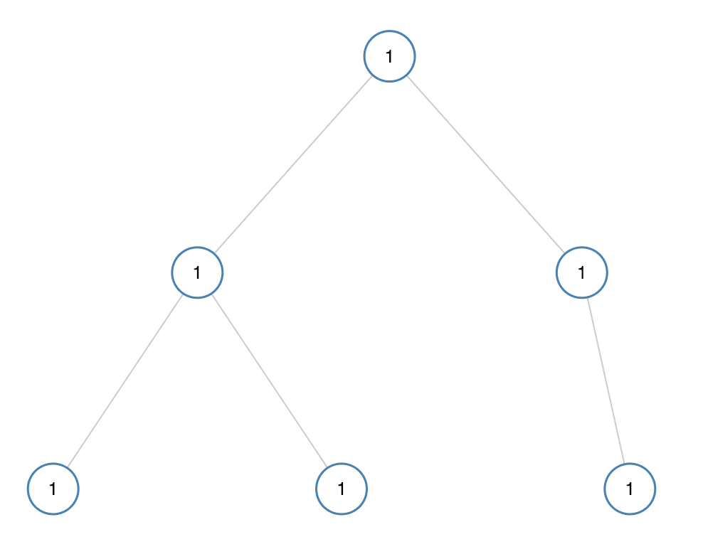
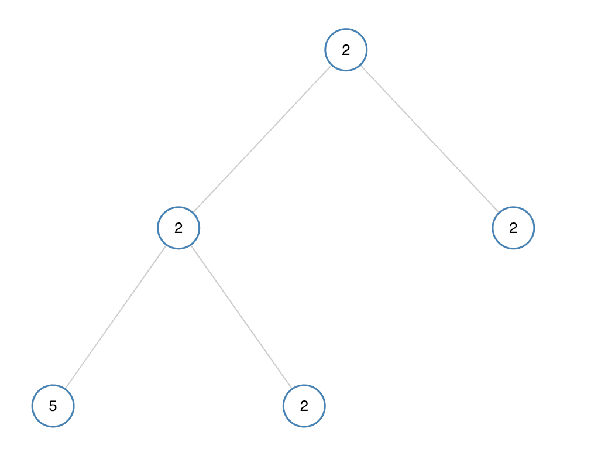

# [965. 单值二叉树](https://leetcode-cn.com/problems/univalued-binary-tree)

[English Version](/solution/0900-0999/0965.Univalued%20Binary%20Tree/README_EN.md)

## 题目描述

<!-- 这里写题目描述 -->
<p>如果二叉树每个节点都具有相同的值，那么该二叉树就是<em>单值</em>二叉树。</p>

<p>只有给定的树是单值二叉树时，才返回&nbsp;<code>true</code>；否则返回 <code>false</code>。</p>

<p>&nbsp;</p>

<p><strong>示例 1：</strong></p>



<pre><strong>输入：</strong>[1,1,1,1,1,null,1]
<strong>输出：</strong>true
</pre>

<p><strong>示例 2：</strong></p>



<pre><strong>输入：</strong>[2,2,2,5,2]
<strong>输出：</strong>false
</pre>

<p>&nbsp;</p>

<p><strong>提示：</strong></p>

<ol>
	<li>给定树的节点数范围是&nbsp;<code>[1, 100]</code>。</li>
	<li>每个节点的值都是整数，范围为&nbsp;<code>[0, 99]</code>&nbsp;。</li>
</ol>

## 解法

<!-- 这里可写通用的实现逻辑 -->

<!-- tabs:start -->

### **Python3**

<!-- 这里可写当前语言的特殊实现逻辑 -->

```python

```

### **Java**

<!-- 这里可写当前语言的特殊实现逻辑 -->

```java

```

### **...**

```

```

<!-- tabs:end -->
