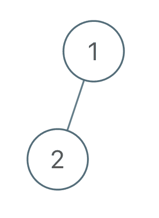
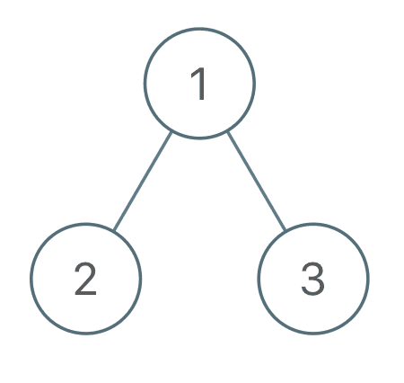

# [971. 翻转二叉树以匹配先序遍历](https://leetcode-cn.com/problems/flip-binary-tree-to-match-preorder-traversal)

[English Version](/solution/0900-0999/0971.Flip%20Binary%20Tree%20To%20Match%20Preorder%20Traversal/README_EN.md)

## 题目描述

<!-- 这里写题目描述 -->
<p>给定一个有 <code>N</code> 个节点的二叉树，每个节点都有一个不同于其他节点且处于 <code>{1, ..., N}</code> 中的值。</p>

<p>通过交换节点的左子节点和右子节点，可以翻转该二叉树中的节点。</p>

<p>考虑从根节点开始的先序遍历报告的 <code>N</code> 值序列。将这一 <code>N</code> 值序列称为树的行程。</p>

<p>（回想一下，节点的先序遍历意味着我们报告当前节点的值，然后先序遍历左子节点，再先序遍历右子节点。）</p>

<p>我们的目标是翻转<strong>最少的</strong>树中节点，以便树的行程与给定的行程&nbsp;<code>voyage</code>&nbsp;相匹配。&nbsp;</p>

<p>如果可以，则返回翻转的所有节点的值的列表。你可以按任何顺序返回答案。</p>

<p>如果不能，则返回列表 <code>[-1]</code>。</p>

<p>&nbsp;</p>

<p><strong>示例 1：</strong></p>



<pre><strong>输入：</strong>root = [1,2], voyage = [2,1]
<strong>输出：</strong>[-1]
</pre>

<p><strong>示例 2：</strong></p>



<pre><strong>输入：</strong>root = [1,2,3], voyage = [1,3,2]
<strong>输出：</strong>[1]
</pre>

<p><strong>示例 3：</strong></p>


<pre><strong>输入：</strong>root = [1,2,3], voyage = [1,2,3]
<strong>输出：</strong>[]
</pre>

<p>&nbsp;</p>

<p><strong>提示：</strong></p>

<ol>
	<li><code>1 &lt;= N &lt;= 100</code></li>
</ol>

## 解法

<!-- 这里可写通用的实现逻辑 -->

<!-- tabs:start -->

### **Python3**

<!-- 这里可写当前语言的特殊实现逻辑 -->

```python

```

### **Java**

<!-- 这里可写当前语言的特殊实现逻辑 -->

```java

```

### **...**

```

```

<!-- tabs:end -->
