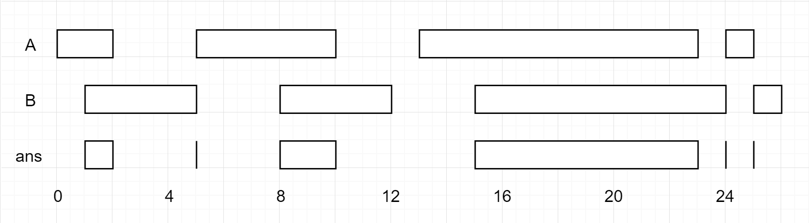

# [986. 区间列表的交集](https://leetcode-cn.com/problems/interval-list-intersections)

[English Version](/solution/0900-0999/0986.Interval%20List%20Intersections/README_EN.md)

## 题目描述

<!-- 这里写题目描述 -->
<p>给定两个由一些<strong>闭区间</strong>组成的列表，每个区间列表都是成对不相交的，并且已经排序。</p>

<p>返回这两个区间列表的交集。</p>

<p><em>（形式上，闭区间&nbsp;<code>[a, b]</code>（其中&nbsp;<code>a &lt;= b</code>）表示实数&nbsp;<code>x</code>&nbsp;的集合，而&nbsp;<code>a &lt;= x &lt;= b</code>。两个闭区间的交集是一组实数，要么为空集，要么为闭区间。例如，[1, 3] 和 [2, 4] 的交集为 [2, 3]。）</em></p>

<p>&nbsp;</p>

<p><strong>示例：</strong></p>



<pre><strong>输入：</strong>A = [[0,2],[5,10],[13,23],[24,25]], B = [[1,5],[8,12],[15,24],[25,26]]
<strong>输出：</strong>[[1,2],[5,5],[8,10],[15,23],[24,24],[25,25]]
<strong>注意：</strong>输入和所需的输出都是区间对象组成的列表，而不是数组或列表。
</pre>

<p>&nbsp;</p>

<p><strong>提示：</strong></p>

<ol>
	<li><code>0 &lt;= A.length &lt; 1000</code></li>
	<li><code>0 &lt;= B.length &lt; 1000</code></li>
	<li><code>0 &lt;= A[i].start, A[i].end, B[i].start, B[i].end &lt; 10^9</code></li>
</ol>

## 解法

<!-- 这里可写通用的实现逻辑 -->

<!-- tabs:start -->

### **Python3**

<!-- 这里可写当前语言的特殊实现逻辑 -->

```python

```

### **Java**

<!-- 这里可写当前语言的特殊实现逻辑 -->

```java

```

### **...**

```

```

<!-- tabs:end -->
