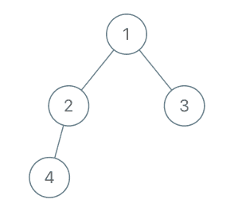
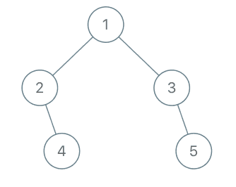
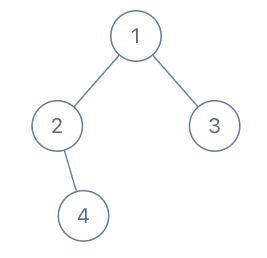

# [993. 二叉树的堂兄弟节点](https://leetcode-cn.com/problems/cousins-in-binary-tree)

[English Version](/solution/0900-0999/0993.Cousins%20in%20Binary%20Tree/README_EN.md)

## 题目描述
<!-- 这里写题目描述 -->
<p>在二叉树中，根节点位于深度 <code>0</code> 处，每个深度为 <code>k</code> 的节点的子节点位于深度 <code>k+1</code> 处。</p>

<p>如果二叉树的两个节点深度相同，但<strong>父节点不同</strong>，则它们是一对<em>堂兄弟节点</em>。</p>

<p>我们给出了具有唯一值的二叉树的根节点 <code>root</code>，以及树中两个不同节点的值 <code>x</code> 和 <code>y</code>。</p>

<p>只有与值 <code>x</code> 和 <code>y</code> 对应的节点是堂兄弟节点时，才返回 <code>true</code>。否则，返回 <code>false</code>。</p>

<p>&nbsp;</p>

<p><strong>示例 1：<br>



</strong></p>

<pre><strong>输入：</strong>root = [1,2,3,4], x = 4, y = 3
<strong>输出：</strong>false
</pre>

<p><strong>示例 2：<br>



</strong></p>

<pre><strong>输入：</strong>root = [1,2,3,null,4,null,5], x = 5, y = 4
<strong>输出：</strong>true
</pre>

<p><strong>示例 3：</strong></p>



<pre><strong>输入：</strong>root = [1,2,3,null,4], x = 2, y = 3
<strong>输出：</strong>false</pre>

<p>&nbsp;</p>

<p><strong>提示：</strong></p>

<ol>
	<li>二叉树的节点数介于&nbsp;<code>2</code> 到&nbsp;<code>100</code>&nbsp;之间。</li>
	<li>每个节点的值都是唯一的、范围为&nbsp;<code>1</code> 到&nbsp;<code>100</code>&nbsp;的整数。</li>
</ol>

<p>&nbsp;</p>


## 解法
<!-- 这里可写通用的实现逻辑 -->


<!-- tabs:start -->

### **Python3**
<!-- 这里可写当前语言的特殊实现逻辑 -->

```python

```

### **Java**
<!-- 这里可写当前语言的特殊实现逻辑 -->

```java

```

### **...**
```

```

<!-- tabs:end -->