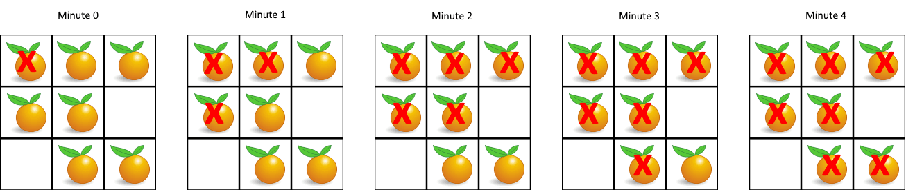

# [994. Rotting Oranges](https://leetcode.com/problems/rotting-oranges)

[中文文档](/solution/0900-0999/0994.Rotting%20Oranges/README.md)

## Description
<p>In a given grid, each cell can have one of three&nbsp;values:</p>


<ul>
	<li>the value <code>0</code> representing an empty cell;</li>
	<li>the value <code>1</code> representing a fresh orange;</li>
	<li>the value <code>2</code> representing a rotten orange.</li>
</ul>


<p>Every minute, any fresh orange that is adjacent (4-directionally) to a rotten orange becomes rotten.</p>


<p>Return the minimum number of minutes that must elapse until no cell has a fresh orange.&nbsp; If this is impossible, return <code>-1</code> instead.</p>


<p>&nbsp;</p>


<div>

<p><strong>Example 1:</strong></p>





<pre>

<strong>Input: </strong><span id="example-input-1-1">[[2,1,1],[1,1,0],[0,1,1]]</span>

<strong>Output: </strong><span id="example-output-1">4</span>

</pre>


<div>

<p><strong>Example 2:</strong></p>


<pre>

<strong>Input: </strong><span id="example-input-2-1">[[2,1,1],[0,1,1],[1,0,1]]</span>

<strong>Output: </strong><span id="example-output-2">-1</span>

<strong>Explanation: </strong> The orange in the bottom left corner (row 2, column 0) is never rotten, because rotting only happens 4-directionally.

</pre>


<div>

<p><strong>Example 3:</strong></p>


<pre>

<strong>Input: </strong><span id="example-input-3-1">[[0,2]]</span>

<strong>Output: </strong><span id="example-output-3">0</span>

<strong>Explanation: </strong> Since there are already no fresh oranges at minute 0, the answer is just 0.

</pre>


<p>&nbsp;</p>


<p><strong>Note:</strong></p>


<ol>
	<li><code>1 &lt;= grid.length &lt;= 10</code></li>
	<li><code>1 &lt;= grid[0].length &lt;= 10</code></li>
	<li><code>grid[i][j]</code> is only <code>0</code>, <code>1</code>, or <code>2</code>.</li>
</ol>

</div>

</div>

</div>


## Solutions


<!-- tabs:start -->

### **Python3**

```python

```

### **Java**

```java

```

### **...**
```

```

<!-- tabs:end -->