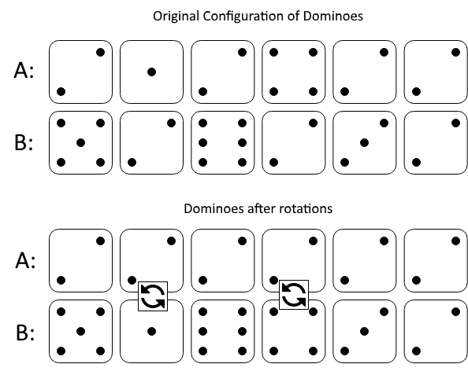

# [1007. Minimum Domino Rotations For Equal Row](https://leetcode.com/problems/minimum-domino-rotations-for-equal-row)

[中文文档](/solution/1000-1099/1007.Minimum%20Domino%20Rotations%20For%20Equal%20Row/README.md)

## Description

<p>In a row of dominoes, <code>A[i]</code> and <code>B[i]</code> represent the top and bottom halves of the <code>i</code>-th domino.&nbsp; (A domino is a tile with two numbers from 1 to 6 - one on each half of the tile.)</p>

<p>We may rotate the <code>i</code>-th domino, so that <code>A[i]</code> and <code>B[i]</code> swap values.</p>

<p>Return the minimum number of rotations so that all the values in <code>A</code> are the same, or all the values in <code>B</code>&nbsp;are the same.</p>

<p>If it cannot be done, return <code>-1</code>.</p>

<p>&nbsp;</p>

<p><strong>Example 1:</strong></p>



<pre>

<strong>Input: </strong>A = <span id="example-input-1-1">[2,1,2,4,2,2]</span>, B = <span id="example-input-1-2">[5,2,6,2,3,2]</span>

<strong>Output: </strong><span id="example-output-1">2</span>

<strong>Explanation: </strong>

The first figure represents the dominoes as given by A and B: before we do any rotations.

If we rotate the second and fourth dominoes, we can make every value in the top row equal to 2, as indicated by the second figure.

</pre>

<p><strong>Example 2:</strong></p>

<pre>

<strong>Input: </strong>A = <span id="example-input-2-1">[3,5,1,2,3]</span>, B = <span id="example-input-2-2">[3,6,3,3,4]</span>

<strong>Output: </strong><span id="example-output-2">-1</span>

<strong>Explanation: </strong>

In this case, it is not possible to rotate the dominoes to make one row of values equal.

</pre>

<p>&nbsp;</p>

<p><strong>Note:</strong></p>

<ol>
	<li><code>1 &lt;= A[i], B[i] &lt;= 6</code></li>
	<li><code>2 &lt;= A.length == B.length &lt;= 20000</code></li>
</ol>

## Solutions

<!-- tabs:start -->

### **Python3**

```python

```

### **Java**

```java

```

### **...**

```

```

<!-- tabs:end -->
<!-- tabs:end -->
