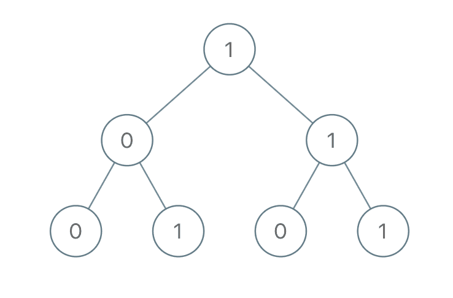

# [1022. 从根到叶的二进制数之和](https://leetcode-cn.com/problems/sum-of-root-to-leaf-binary-numbers)

[English Version](/solution/1000-1099/1022.Sum%20of%20Root%20To%20Leaf%20Binary%20Numbers/README_EN.md)

## 题目描述
<!-- 这里写题目描述 -->
<p>给出一棵二叉树，其上每个结点的值都是&nbsp;<code>0</code>&nbsp;或&nbsp;<code>1</code>&nbsp;。每一条从根到叶的路径都代表一个从最高有效位开始的二进制数。例如，如果路径为&nbsp;<code>0 -&gt; 1 -&gt; 1 -&gt; 0 -&gt; 1</code>，那么它表示二进制数&nbsp;<code>01101</code>，也就是&nbsp;<code>13</code>&nbsp;。</p>

<p>对树上的每一片叶子，我们都要找出从根到该叶子的路径所表示的数字。</p>

<p>以<strong>&nbsp;<code>10^9 + 7</code></strong>&nbsp;为<strong>模</strong>，返回这些数字之和。</p>

<p>&nbsp;</p>

<p><strong>示例：</strong></p>



<pre><strong>输入：</strong>[1,0,1,0,1,0,1]
<strong>输出：</strong>22
<strong>解释：</strong>(100) + (101) + (110) + (111) = 4 + 5 + 6 + 7 = 22
</pre>

<p>&nbsp;</p>

<p><strong>提示：</strong></p>

<ol>
	<li>树中的结点数介于 <code>1</code> 和 <code>1000</code> 之间。</li>
	<li>node.val 为&nbsp;<code>0</code> 或&nbsp;<code>1</code>&nbsp;。</li>
</ol>


## 解法
<!-- 这里可写通用的实现逻辑 -->


<!-- tabs:start -->

### **Python3**
<!-- 这里可写当前语言的特殊实现逻辑 -->

```python

```

### **Java**
<!-- 这里可写当前语言的特殊实现逻辑 -->

```java

```

### **...**
```

```

<!-- tabs:end -->