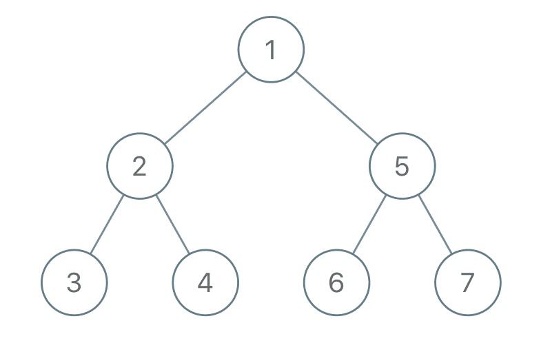
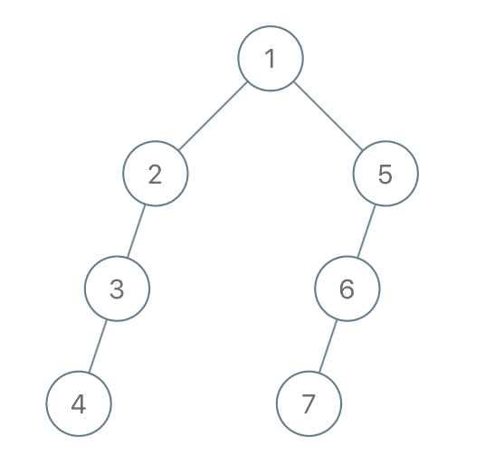
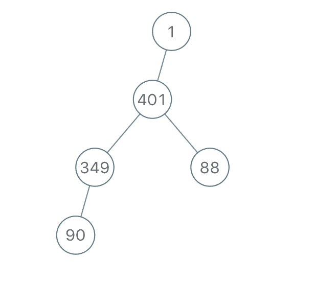

# [1028. Recover a Tree From Preorder Traversal](https://leetcode.com/problems/recover-a-tree-from-preorder-traversal)

[中文文档](/solution/1000-1099/1028.Recover%20a%20Tree%20From%20Preorder%20Traversal/README.md)

## Description
<p>We run a&nbsp;preorder&nbsp;depth first search on the <code>root</code> of a binary tree.</p>


<p>At each node in this traversal, we output <code>D</code> dashes (where <code>D</code> is the <em>depth</em> of this node), then we output the value of this node.&nbsp;&nbsp;<em>(If the depth of a node is <code>D</code>, the depth of its immediate child is <code>D+1</code>.&nbsp; The depth of the root node is <code>0</code>.)</em></p>


<p>If a node has only one child, that child is guaranteed to be the left child.</p>


<p>Given the output <code>S</code> of this traversal, recover the tree and return its <code>root</code>.</p>


<p>&nbsp;</p>


<p><strong>Example 1:</strong></p>




<pre>

<strong>Input: </strong><span id="example-input-1-1">&quot;1-2--3--4-5--6--7&quot;</span>

<strong>Output: </strong><span id="example-output-1">[1,2,5,3,4,6,7]</span>

</pre>


<div>

<p><strong>Example 2:</strong></p>





<pre>

<strong>Input: </strong><span id="example-input-2-1">&quot;1-2--3---4-5--6---7&quot;</span>

<strong>Output: </strong><span id="example-output-2">[1,2,5,3,null,6,null,4,null,7]</span></pre>

</div>


<div>

<p>&nbsp;</p>


<div>

<p><strong>Example 3:</strong></p>





<pre>

<strong>Input: </strong><span id="example-input-3-1">&quot;1-401--349---90--88&quot;</span>

<strong>Output: </strong><span id="example-output-3">[1,401,null,349,88,90]</span>

</pre>

</div>


<p>&nbsp;</p>


<p><strong>Note:</strong></p>


<ul>
	<li>The number of nodes in the original tree is between <code>1</code> and <code>1000</code>.</li>
	<li>Each node will have a value between <code>1</code> and <code>10^9</code>.</li>
</ul>

</div>


## Solutions


<!-- tabs:start -->

### **Python3**

```python

```

### **Java**

```java

```

### **...**
```

```

<!-- tabs:end -->