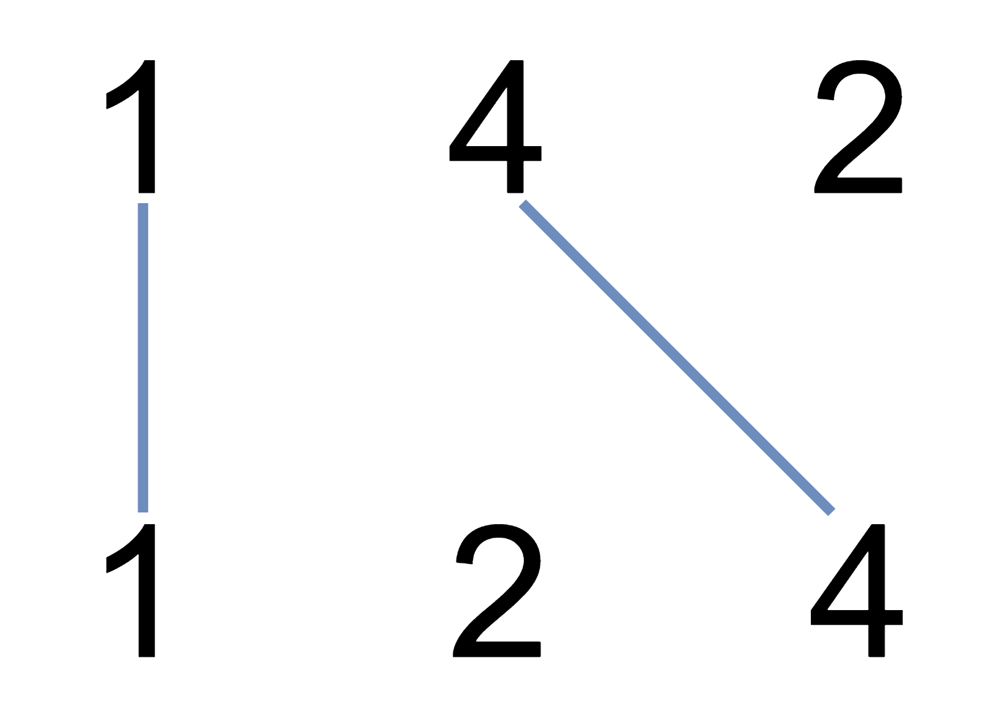

# [1035. Uncrossed Lines](https://leetcode.com/problems/uncrossed-lines)

[中文文档](/solution/1000-1099/1035.Uncrossed%20Lines/README.md)

## Description

<p>We write the integers of <code>A</code> and <code>B</code>&nbsp;(in the order they are given) on two separate horizontal lines.</p>

<p>Now, we may draw <em>connecting lines</em>: a straight line connecting two numbers <code>A[i]</code> and <code>B[j]</code>&nbsp;such that:</p>

<ul>
	<li><code>A[i] == B[j]</code>;</li>
	<li>The line we draw does not intersect any other connecting (non-horizontal) line.</li>
</ul>

<p>Note that a connecting lines cannot intersect even at the endpoints:&nbsp;each number can only belong to one connecting line.</p>

<p>Return the maximum number of connecting lines we can draw in this way.</p>

<p>&nbsp;</p>

<p><strong>Example 1:</strong></p>



<pre>

<strong>Input: </strong>A = <span id="example-input-1-1">[1,4,2]</span>, B = <span id="example-input-1-2">[1,2,4]</span>

<strong>Output: </strong><span id="example-output-1">2</span>

<strong>Explanation: </strong>We can draw 2 uncrossed lines as in the diagram.

We cannot draw 3 uncrossed lines, because the line from A[1]=4 to B[2]=4 will intersect the line from A[2]=2 to B[1]=2.

</pre>

<div>

<p><strong>Example 2:</strong></p>

<pre>

<strong>Input: </strong>A = <span id="example-input-2-1">[2,5,1,2,5]</span>, B = <span id="example-input-2-2">[10,5,2,1,5,2]</span>

<strong>Output: </strong><span id="example-output-2">3</span>

</pre>

<div>

<p><strong>Example 3:</strong></p>

<pre>

<strong>Input: </strong>A = <span id="example-input-3-1">[1,3,7,1,7,5]</span>, B = <span id="example-input-3-2">[1,9,2,5,1]</span>

<strong>Output: </strong><span id="example-output-3">2</span></pre>

<p>&nbsp;</p>

</div>

</div>

<p><strong>Note:</strong></p>

<ol>
	<li><code>1 &lt;= A.length &lt;= 500</code></li>
	<li><code>1 &lt;= B.length &lt;= 500</code></li>
	<li><code><font face="monospace">1 &lt;= A[i], B[i] &lt;= 2000</font></code></li>
</ol>

## Solutions

<!-- tabs:start -->

### **Python3**

```python

```

### **Java**

```java

```

### **...**

```

```

<!-- tabs:end -->
