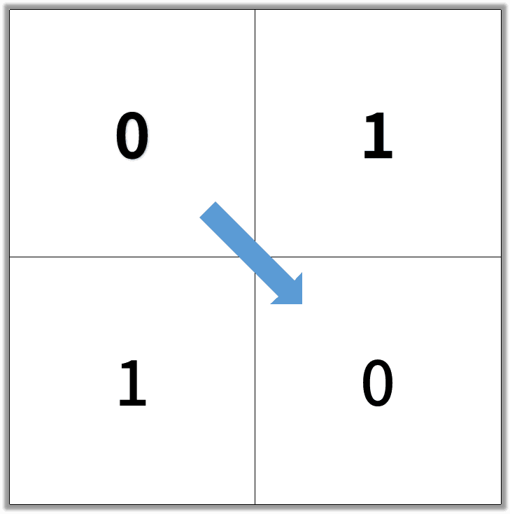
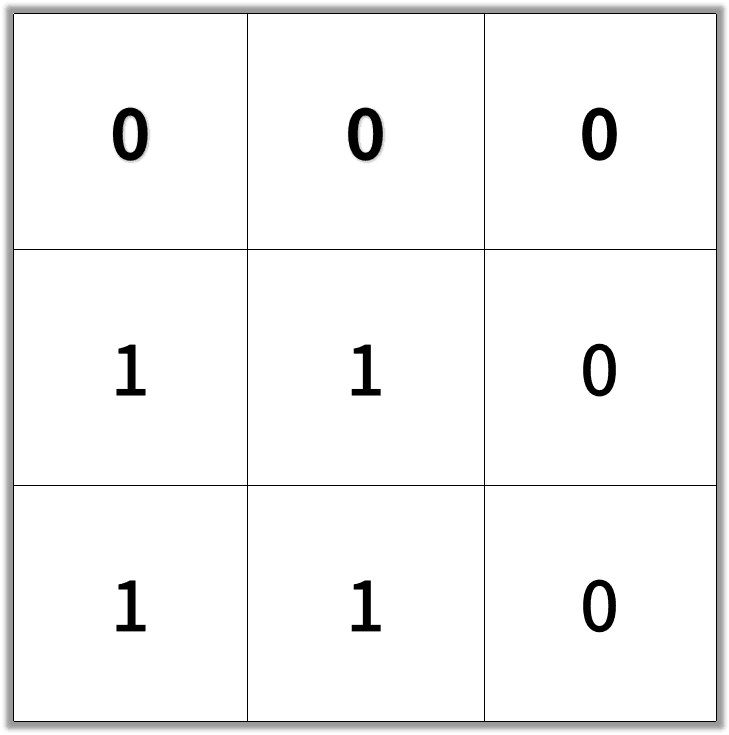

# [1091. 二进制矩阵中的最短路径](https://leetcode-cn.com/problems/shortest-path-in-binary-matrix)

[English Version](/solution/1000-1099/1091.Shortest%20Path%20in%20Binary%20Matrix/README_EN.md)

## 题目描述

<!-- 这里写题目描述 -->
<p>在一个&nbsp;N &times;&nbsp;N 的方形网格中，每个单元格有两种状态：空（0）或者阻塞（1）。</p>

<p>一条从左上角到右下角、长度为 <code>k</code> 的畅通路径，由满足下述条件的单元格&nbsp;<code>C_1, C_2, ..., C_k</code>&nbsp;组成：</p>

<ul>
	<li>相邻单元格&nbsp;<code>C_i</code> 和&nbsp;<code>C_{i+1}</code>&nbsp;在八个方向之一上连通（此时，<code>C_i</code> 和&nbsp;<code>C_{i+1}</code>&nbsp;不同且共享边或角）</li>
	<li><code>C_1</code> 位于&nbsp;<code>(0, 0)</code>（即，值为&nbsp;<code>grid[0][0]</code>）</li>
	<li><code>C_k</code>&nbsp;位于&nbsp;<code>(N-1, N-1)</code>（即，值为&nbsp;<code>grid[N-1][N-1]</code>）</li>
	<li>如果 <code>C_i</code> 位于&nbsp;<code>(r, c)</code>，则 <code>grid[r][c]</code>&nbsp;为空（即，<code>grid[r][c] ==&nbsp;0</code>）</li>
</ul>

<p>返回这条从左上角到右下角的最短畅通路径的长度。如果不存在这样的路径，返回 -1 。</p>

<p>&nbsp;</p>

<p><strong>示例 1：</strong></p>

<pre><strong>输入：</strong>[[0,1],[1,0]]</pre>


<pre><strong>输出：</strong>2</pre>



<p><strong>示例 2：</strong></p>

<pre><strong>输入：</strong>[[0,0,0],[1,1,0],[1,1,0]]</pre>



<pre><strong>输出：</strong>4</pre>


<p>&nbsp;</p>

<p><strong>提示：</strong></p>

<ol>
	<li><code>1 &lt;= grid.length == grid[0].length &lt;= 100</code></li>
	<li><code>grid[i][j]</code> 为&nbsp;<code>0</code> 或&nbsp;<code>1</code></li>
</ol>

## 解法

<!-- 这里可写通用的实现逻辑 -->

<!-- tabs:start -->

### **Python3**

<!-- 这里可写当前语言的特殊实现逻辑 -->

```python

```

### **Java**

<!-- 这里可写当前语言的特殊实现逻辑 -->

```java

```

### **...**

```

```

<!-- tabs:end -->
