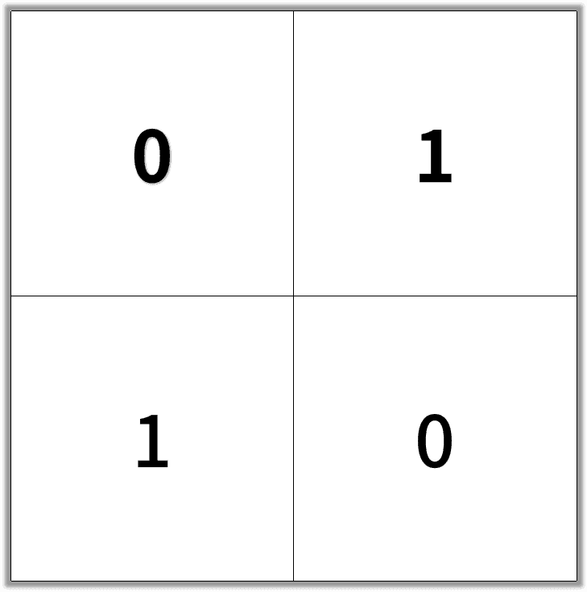
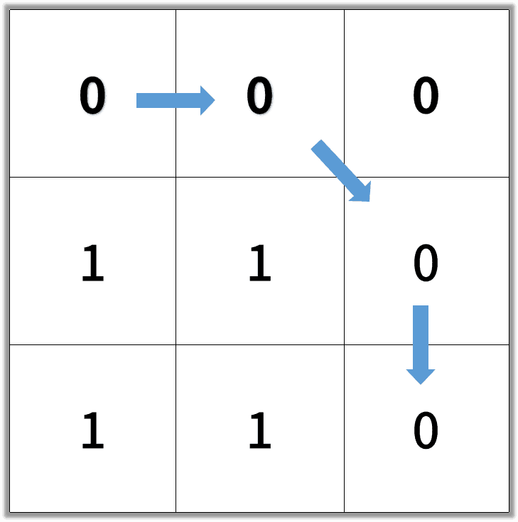

# [1091. Shortest Path in Binary Matrix](https://leetcode.com/problems/shortest-path-in-binary-matrix)

[中文文档](/solution/1000-1099/1091.Shortest%20Path%20in%20Binary%20Matrix/README.md)

## Description
<p>In an N by N square grid, each cell is either empty (0) or blocked (1).</p>

<p>A&nbsp;<em>clear&nbsp;path from top-left to bottom-right</em>&nbsp;has length <code>k</code> if and only if it is composed of cells <code>C_1, C_2, ..., C_k</code>&nbsp;such that:</p>

<ul>
	<li>Adjacent cells <code>C_i</code> and <code>C_{i+1}</code> are connected 8-directionally (ie., they are different and&nbsp;share an edge or corner)</li>
	<li><code>C_1</code> is at location <code>(0, 0)</code> (ie. has value <code>grid[0][0]</code>)</li>
	<li><code>C_k</code>&nbsp;is at location <code>(N-1, N-1)</code> (ie. has value <code>grid[N-1][N-1]</code>)</li>
	<li>If <code>C_i</code> is located at&nbsp;<code>(r, c)</code>, then <code>grid[r][c]</code> is empty (ie.&nbsp;<code>grid[r][c] ==&nbsp;0</code>).</li>
</ul>

<p>Return the length of the shortest such clear path from top-left to bottom-right.&nbsp; If such a path does not exist, return -1.</p>

<p>&nbsp;</p>

<p><strong>Example 1:</strong></p>

<pre>
<strong>Input: </strong><span id="example-input-1-1">[[0,1],[1,0]]</pre></span>



<pre><strong>Output: </strong>2</pre>


<div>
<p><strong>Example 2:</strong></p>

<pre>
<strong>Input: </strong><span id="example-input-2-1">[[0,0,0],[1,1,0],[1,1,0]]
</span></pre>


<pre><strong>Output:</strong> 4
</pre>



<p>&nbsp;</p>
</div>

<p><strong>Note:</strong></p>

<ol>
	<li><code>1 &lt;= grid.length == grid[0].length &lt;= 100</code></li>
	<li><code>grid[r][c]</code> is <code>0</code> or <code>1</code></li>
</ol>


## Solutions


<!-- tabs:start -->

### **Python3**

```python

```

### **Java**

```java

```

### **...**
```

```

<!-- tabs:end -->