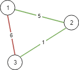

# [1135. Connecting Cities With Minimum Cost](https://leetcode.com/problems/connecting-cities-with-minimum-cost)

[中文文档](/solution/1100-1199/1135.Connecting%20Cities%20With%20Minimum%20Cost/README.md)

## Description

<p>There are <code>N</code> cities numbered from 1 to <code>N</code>.</p>

<p>You are given <code>connections</code>, where each <code>connections[i] = [city1, city2, cost]</code> represents the cost to connect <code>city1</code> and <code>city2</code> together.  (A <em>connection</em> is bidirectional: connecting <code>city1</code> and <code>city2</code> is the same as connecting <code>city2</code> and <code>city1</code>.)</p>

<p>Return the minimum cost so that for every pair of cities, there exists a path of connections (possibly of length 1) that connects those two cities together.  The cost is the sum of the connection costs used. If the task is impossible, return -1.</p>

<p> </p>

<p><strong>Example 1:</strong></p>



<pre>
<strong>Input: </strong>N = 3, connections = [[1,2,5],[1,3,6],[2,3,1]]
<strong>Output: </strong>6
<strong>Explanation: </strong>
Choosing any 2 edges will connect all cities so we choose the minimum 2.
</pre>

<p><strong>Example 2:</strong></p>


<pre>
<strong>Input: </strong>N = 4, connections = [[1,2,3],[3,4,4]]
<strong>Output: </strong>-1
<strong>Explanation: </strong>
There is no way to connect all cities even if all edges are used.
</pre>

<p> </p>

<p><strong>Note:</strong></p>

<ol>
	<li><code>1 <= N <= 10000</code></li>
	<li><code>1 <= connections.length <= 10000</code></li>
	<li><code>1 <= connections[i][0], connections[i][1] <= N</code></li>
	<li><code>0 <= connections[i][2] <= 10^5</code></li>
	<li><code>connections[i][0] != connections[i][1]</code></li>
</ol>

## Solutions

<!-- tabs:start -->

### **Python3**

```python

```

### **Java**

```java

```

### **...**

```

```

<!-- tabs:end -->
