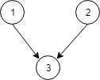
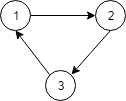

# [1136. 平行课程](https://leetcode-cn.com/problems/parallel-courses)

[English Version](/solution/1100-1199/1136.Parallel%20Courses/README_EN.md)

## 题目描述
<!-- 这里写题目描述 -->
<p>已知有 <code>N</code> 门课程，它们以 <code>1</code> 到 <code>N</code> 进行编号。</p>

<p>给你一份课程关系表 <code>relations[i] = [X, Y]</code>，用以表示课程 <code>X</code> 和课程 <code>Y</code> 之间的先修关系：课程 <code>X</code> 必须在课程 <code>Y</code> 之前修完。</p>

<p>假设在一个学期里，你可以学习任何数量的课程，但前提是你已经学习了将要学习的这些课程的所有先修课程。</p>

<p>请你返回学完全部课程所需的最少学期数。</p>

<p>如果没有办法做到学完全部这些课程的话，就返回 <code>-1</code>。</p>

<p> </p>

<p><strong>示例 1：</strong></p>



<pre><strong>输入：</strong>N = 3, relations = [[1,3],[2,3]]
<strong>输出：</strong>2
<strong>解释：</strong>
在第一个学期学习课程 1 和 2，在第二个学期学习课程 3。
</pre>

<p><strong>示例 2：</strong></p>



<pre><strong>输入：</strong>N = 3, relations = [[1,2],[2,3],[3,1]]
<strong>输出：</strong>-1
<strong>解释：</strong>
没有课程可以学习，因为它们相互依赖。</pre>

<p> </p>

<p><strong>提示：</strong></p>

<ol>
	<li><code>1 <= N <= 5000</code></li>
	<li><code>1 <= relations.length <= 5000</code></li>
	<li><code>relations[i][0] != relations[i][1]</code></li>
	<li>输入中没有重复的关系</li>
</ol>


## 解法
<!-- 这里可写通用的实现逻辑 -->


<!-- tabs:start -->

### **Python3**
<!-- 这里可写当前语言的特殊实现逻辑 -->

```python

```

### **Java**
<!-- 这里可写当前语言的特殊实现逻辑 -->

```java

```

### **...**
```

```

<!-- tabs:end -->