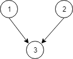
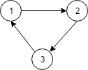

# [1136. Parallel Courses](https://leetcode.com/problems/parallel-courses)

[中文文档](/solution/1100-1199/1136.Parallel%20Courses/README.md)

## Description

<p>There are <code>N</code> courses, labelled from 1 to <code>N</code>.</p>

<p>We are given <code>relations[i] = [X, Y]</code>, representing a prerequisite relationship between course <code>X</code> and course <code>Y</code>: course <code>X</code> has to be studied before course <code>Y</code>.</p>

<p>In one semester you can study any number of courses as long as you have studied all the prerequisites for the course you are studying.</p>

<p>Return the minimum number of semesters needed to study all courses.  If there is no way to study all the courses, return <code>-1</code>.</p>

<p> </p>

<p><strong>Example 1:</strong></p>



<pre>
<strong>Input: </strong>N = <span id="example-input-1-1">3</span>, relations = <span id="example-input-1-2">[[1,3],[2,3]]</span>
<strong>Output: </strong><span id="example-output-1">2</span>
<strong>Explanation: </strong>
In the first semester, courses 1 and 2 are studied. In the second semester, course 3 is studied.
</pre>

<p><strong>Example 2:</strong></p>



<pre>
<strong>Input: </strong>N = <span id="example-input-2-1">3</span>, relations = <span id="example-input-2-2">[[1,2],[2,3],[3,1]]</span>
<strong>Output: </strong><span id="example-output-2">-1</span>
<strong>Explanation: </strong>
No course can be studied because they depend on each other.
</pre>

<p> </p>

<p><strong><span>Note:</span></strong></p>

<ol>
	<li><code>1 <= N <= 5000</code></li>
	<li><code>1 <= relations.length <= 5000</code></li>
	<li><code>relations[i][0] != relations[i][1]</code></li>
	<li>There are no repeated relations in the input.</li>
</ol>

## Solutions

<!-- tabs:start -->

### **Python3**

```python

```

### **Java**

```java

```

### **...**

```

```

<!-- tabs:end -->
