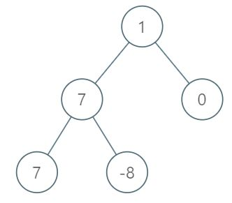

# [1161. Maximum Level Sum of a Binary Tree](https://leetcode.com/problems/maximum-level-sum-of-a-binary-tree)

[中文文档](/solution/1100-1199/1161.Maximum%20Level%20Sum%20of%20a%20Binary%20Tree/README.md)

## Description
<p>Given the <code>root</code> of a binary tree, the level of its root is <code>1</code>,&nbsp;the level of its children is <code>2</code>,&nbsp;and so on.</p>


<p>Return the <strong>smallest</strong> level <code>X</code> such that the sum of all the values of nodes at level <code>X</code> is <strong>maximal</strong>.</p>


<p>&nbsp;</p>


<p><strong>Example 1:</strong></p>





<pre>

<strong>Input: </strong><span id="example-input-1-1">[1,7,0,7,-8,null,null]</span>

<strong>Output: </strong><span id="example-output-1">2</span>

<strong>Explanation: </strong>

Level 1 sum = 1.

Level 2 sum = 7 + 0 = 7.

Level 3 sum = 7 + -8 = -1.

So we return the level with the maximum sum which is level 2.

</pre>


<p>&nbsp;</p>


<p><strong>Note:</strong></p>


<ol>
	<li>The number of nodes in the given tree is between <code>1</code> and <code>10^4</code>.</li>
	<li><code>-10^5 &lt;= node.val &lt;= 10^5</code></li>
</ol>


## Solutions


<!-- tabs:start -->

### **Python3**

```python

```

### **Java**

```java

```

### **...**
```

```

<!-- tabs:end -->