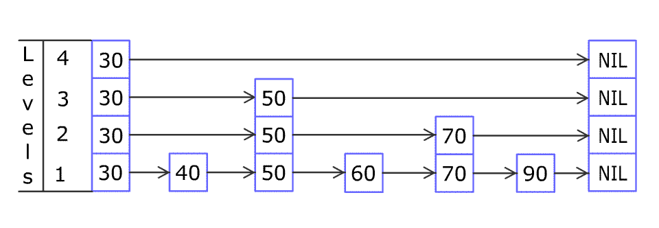

# [1206. 设计跳表](https://leetcode-cn.com/problems/design-skiplist)

[English Version](/solution/1200-1299/1206.Design%20Skiplist/README_EN.md)

## 题目描述
<!-- 这里写题目描述 -->
<p>不使用任何库函数，设计一个跳表。</p>

<p>跳表是在 O(log(n)) 时间内完成增加、删除、搜索操作的数据结构。跳表相比于树堆与红黑树，其功能与性能相当，并且跳表的代码长度相较下更短，其设计思想与链表相似。</p>

<p>例如，一个跳表包含 [30, 40, 50, 60, 70, 90]，然后增加 80、45 到跳表中，以下图的方式操作：</p>

<p>



<small>Artyom Kalinin [CC BY-SA 3.0], via <a href="https://commons.wikimedia.org/wiki/File:Skip_list_add_element-en.gif" target="_blank" title="Artyom Kalinin [CC BY-SA 3.0 (https://creativecommons.org/licenses/by-sa/3.0)], via Wikimedia Commons">Wikimedia Commons</a></small></p>

<p>跳表中有很多层，每一层是一个短的链表。在第一层的作用下，增加、删除和搜索操作的时间复杂度不超过 O(n)。跳表的每一个操作的平均时间复杂度是 O(log(n))，空间复杂度是 O(n)。</p>

<p>在本题中，你的设计应该要包含这些函数：</p>

<ul>
	<li><code>bool search(int target)</code> : 返回target是否存在于跳表中。</li>
	<li><code>void add(int num)</code>:&nbsp;插入一个元素到跳表。</li>
	<li><code>bool erase(int num)</code>: 在跳表中删除一个值，如果&nbsp;<code>num</code>&nbsp;不存在，直接返回false. 如果存在多个&nbsp;<code>num</code>&nbsp;，删除其中任意一个即可。</li>
</ul>

<p>了解更多 :&nbsp;<a href="https://en.wikipedia.org/wiki/Skip_list" target="_blank">https://en.wikipedia.org/wiki/Skip_list</a></p>

<p>注意，跳表中可能存在多个相同的值，你的代码需要处理这种情况。</p>

<p><strong>样例:</strong></p>

<pre>Skiplist skiplist = new Skiplist();

skiplist.add(1);
skiplist.add(2);
skiplist.add(3);
skiplist.search(0);   // 返回 false
skiplist.add(4);
skiplist.search(1);   // 返回 true
skiplist.erase(0);    // 返回 false，0 不在跳表中
skiplist.erase(1);    // 返回 true
skiplist.search(1);   // 返回 false，1 已被擦除
</pre>

<p><strong>约束条件:</strong></p>

<ul>
	<li><code>0 &lt;= num, target&nbsp;&lt;= 20000</code></li>
	<li>最多调用&nbsp;<code>50000</code>&nbsp;次&nbsp;<code>search</code>, <code>add</code>, 以及&nbsp;<code>erase</code>操作。</li>
</ul>


## 解法
<!-- 这里可写通用的实现逻辑 -->


<!-- tabs:start -->

### **Python3**
<!-- 这里可写当前语言的特殊实现逻辑 -->

```python

```

### **Java**
<!-- 这里可写当前语言的特殊实现逻辑 -->

```java

```

### **...**
```

```

<!-- tabs:end -->