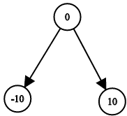

# [1214. 查找两棵二叉搜索树之和](https://leetcode-cn.com/problems/two-sum-bsts)

[English Version](/solution/1200-1299/1214.Two%20Sum%20BSTs/README_EN.md)

## 题目描述
<!-- 这里写题目描述 -->
<p>给出两棵二叉搜索树，请你从两棵树中各找出一个节点，使得这两个节点的值之和等于目标值 <code>Target</code>。</p>

<p>如果可以找到返回 <code>True</code>，否则返回 <code>False</code>。</p>

<p> </p>

<p><strong>示例 1：</strong></p>


<pre><strong>输入：</strong>root1 = [2,1,4], root2 = [1,0,3], target = 5
<strong>输出：</strong>true
<strong>解释：</strong>2 加 3 和为 5 。
</pre>

<p><strong>示例 2：</strong></p>




<pre><strong>输入：</strong>root1 = [0,-10,10], root2 = [5,1,7,0,2], target = 18
<strong>输出：</strong>false</pre>

<p> </p>

<p><strong>提示：</strong></p>

<ol>
	<li>每棵树上最多有 <code>5000</code> 个节点。</li>
	<li><code>-10^9 <= target, node.val <= 10^9</code></li>
</ol>


## 解法
<!-- 这里可写通用的实现逻辑 -->


<!-- tabs:start -->

### **Python3**
<!-- 这里可写当前语言的特殊实现逻辑 -->

```python

```

### **Java**
<!-- 这里可写当前语言的特殊实现逻辑 -->

```java

```

### **...**
```

```

<!-- tabs:end -->