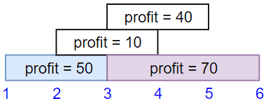
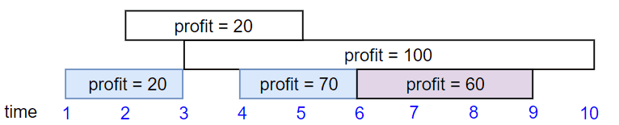
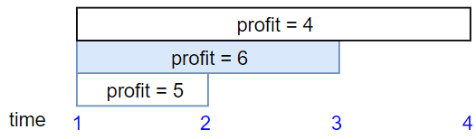

# [1235. Maximum Profit in Job Scheduling](https://leetcode.com/problems/maximum-profit-in-job-scheduling)

[中文文档](/solution/1200-1299/1235.Maximum%20Profit%20in%20Job%20Scheduling/README.md)

## Description
<p>We have <code>n</code> jobs, where every job&nbsp;is scheduled to be done from <code>startTime[i]</code> to <code>endTime[i]</code>, obtaining a profit&nbsp;of <code>profit[i]</code>.</p>

<p>You&#39;re given the&nbsp;<code>startTime</code>&nbsp;,&nbsp;<code>endTime</code>&nbsp;and <code>profit</code>&nbsp;arrays,&nbsp;you need to output the maximum profit you can take such that there are no 2 jobs in the subset&nbsp;with overlapping time range.</p>

<p>If you choose a job that ends at time <code>X</code>&nbsp;you&nbsp;will be able to start another job that starts at time <code>X</code>.</p>

<p>&nbsp;</p>
<p><strong>Example 1:</strong></p>



<pre>
<strong>Input:</strong> startTime = [1,2,3,3], endTime = [3,4,5,6], profit = [50,10,40,70]
<strong>Output:</strong> 120
<strong>Explanation:</strong> The subset chosen is the first and fourth job. 
Time range [1-3]+[3-6] , we get profit of 120 = 50 + 70.
</pre>

<p><strong>Example 2:</strong></p>



<pre>
<strong>
Input:</strong> startTime = [1,2,3,4,6], endTime = [3,5,10,6,9], profit = [20,20,100,70,60]
<strong>Output:</strong> 150
<strong>Explanation:</strong> The subset chosen is the first, fourth and fifth job. 
Profit obtained 150 = 20 + 70 + 60.
</pre>

<p><strong>Example 3:</strong></p>



<pre>
<strong>Input:</strong> startTime = [1,1,1], endTime = [2,3,4], profit = [5,6,4]
<strong>Output:</strong> 6
</pre>

<p>&nbsp;</p>
<p><strong>Constraints:</strong></p>

<ul>
	<li><code>1 &lt;= startTime.length == endTime.length ==&nbsp;profit.length&nbsp;&lt;= 5 * 10^4</code></li>
	<li><code>1 &lt;=&nbsp;startTime[i] &lt;&nbsp;endTime[i] &lt;= 10^9</code></li>
	<li><code>1 &lt;=&nbsp;profit[i] &lt;= 10^4</code></li>
</ul>


## Solutions


<!-- tabs:start -->

### **Python3**

```python

```

### **Java**

```java

```

### **...**
```

```

<!-- tabs:end -->