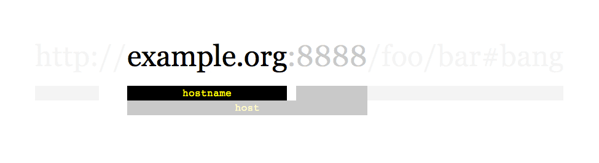
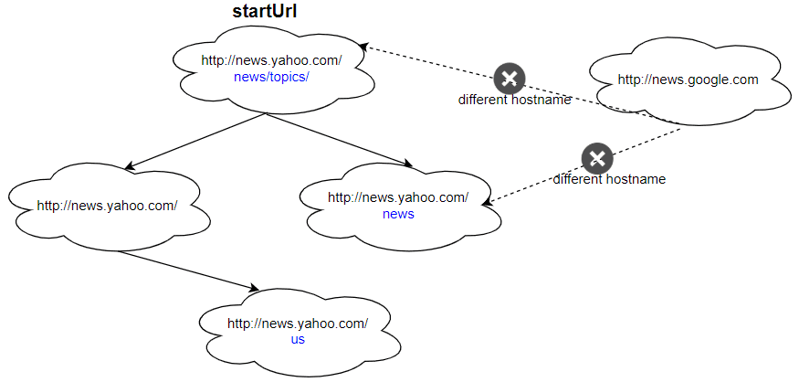
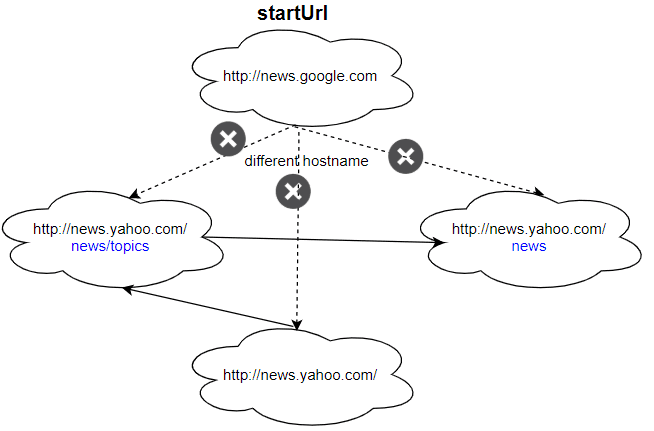

# [1236. 网络爬虫](https://leetcode-cn.com/problems/web-crawler)

[English Version](/solution/1200-1299/1236.Web%20Crawler/README_EN.md)

## 题目描述

<!-- 这里写题目描述 -->
<p>给定一个链接 <code>startUrl</code> 和一个接口 <code>HtmlParser</code> ，请你实现一个网络爬虫，以实现爬取同 <code>startUrl</code> 拥有相同 <strong>域名标签 </strong>的全部链接。该爬虫得到的全部链接可以 <strong>任何顺序 </strong>返回结果。</p>

<p>你的网络爬虫应当按照如下模式工作：</p>

<ul>
	<li>自链接 <code>startUrl</code> 开始爬取</li>
	<li>调用 <code>HtmlParser.getUrls(url)</code> 来获得链接<code>url</code>页面中的全部链接</li>
	<li>同一个链接最多只爬取一次</li>
	<li>只输出 <strong>域名 </strong>与<strong> </strong><code>startUrl</code> <strong>相同 </strong>的链接集合</li>
</ul>



<p>如上所示的一个链接，其域名为 <code>example.org</code>。简单起见，你可以假设所有的链接都采用 <strong>http协议 </strong>并没有指定 <strong>端口</strong>。例如，链接 <code>http://leetcode.com/problems</code> 和 <code>http://leetcode.com/contest</code> 是同一个域名下的，而链接<code>http://example.org/test</code> 和 <code>http://example.com/abc</code> 是不在同一域名下的。</p>

<p><code>HtmlParser</code> 接口定义如下： </p>

<pre>interface HtmlParser {
  // 返回给定 url 对应的页面中的全部 url 。
  public List<String> getUrls(String url);
}</pre>

<p>下面是两个实例，用以解释该问题的设计功能，对于自定义测试，你可以使用三个变量  <code>urls</code>, <code>edges</code> 和 <code>startUrl</code>。注意在代码实现中，你只可以访问 <code>startUrl</code> ，而 <code>urls</code> 和 <code>edges</code> 不可以在你的代码中被直接访问。</p>

<p> </p>

<p><strong>示例 1：</strong></p>



<pre><strong>输入：
</strong>urls = [
  "http://news.yahoo.com",
  "http://news.yahoo.com/news",
  "http://news.yahoo.com/news/topics/",
  "http://news.google.com",
  "http://news.yahoo.com/us"
]
edges = [[2,0],[2,1],[3,2],[3,1],[0,4]]
startUrl = "http://news.yahoo.com/news/topics/"
<strong>输出：</strong>[
  "http://news.yahoo.com",
  "http://news.yahoo.com/news",
  "http://news.yahoo.com/news/topics/",
  "http://news.yahoo.com/us"
]
</pre>

<p><strong>示例 2：</strong></p>



<pre><strong>输入：</strong>
urls = [
  "http://news.yahoo.com",
  "http://news.yahoo.com/news",
  "http://news.yahoo.com/news/topics/",
  "http://news.google.com"
]
edges = [[0,2],[2,1],[3,2],[3,1],[3,0]]
startUrl = "http://news.google.com"
<strong>输入：</strong>["http://news.google.com"]
<strong>解释：</strong>startUrl 链接到所有其他不共享相同主机名的页面。</pre>

<p> </p>

<p><strong>提示：</strong></p>

<ul>
	<li><code>1 <= urls.length <= 1000</code></li>
	<li><code>1 <= urls[i].length <= 300</code></li>
	<li><code>startUrl</code> 为 <code>urls</code> 中的一个。</li>
	<li>域名标签的长为1到63个字符（包括点），只能包含从‘a’到‘z’的ASCII字母、‘0’到‘9’的数字以及连字符即减号（‘-’）。</li>
	<li>域名标签不会以连字符即减号（‘-’）开头或结尾。</li>
	<li>关于域名有效性的约束可参考:  <a href="https://en.wikipedia.org/wiki/Hostname#Restrictions_on_valid_hostnames">https://en.wikipedia.org/wiki/Hostname#Restrictions_on_valid_hostnames</a></li>
	<li>你可以假定url库中不包含重复项。</li>
</ul>

## 解法

<!-- 这里可写通用的实现逻辑 -->

<!-- tabs:start -->

### **Python3**

<!-- 这里可写当前语言的特殊实现逻辑 -->

```python

```

### **Java**

<!-- 这里可写当前语言的特殊实现逻辑 -->

```java

```

### **...**

```

```

<!-- tabs:end -->
