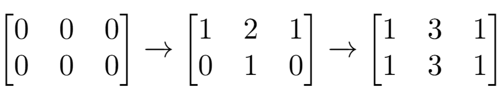

# [1252. 奇数值单元格的数目](https://leetcode-cn.com/problems/cells-with-odd-values-in-a-matrix)

[English Version](/solution/1200-1299/1252.Cells%20with%20Odd%20Values%20in%20a%20Matrix/README_EN.md)

## 题目描述
<!-- 这里写题目描述 -->
<p>给你一个&nbsp;<code>n</code>&nbsp;行&nbsp;<code>m</code>&nbsp;列的矩阵，最开始的时候，每个单元格中的值都是 <code>0</code>。</p>

<p>另有一个索引数组&nbsp;<code>indices</code>，<code>indices[i] = [ri, ci]</code>&nbsp;中的&nbsp;<code>ri</code> 和 <code>ci</code> 分别表示指定的行和列（从 <code>0</code> 开始编号）。</p>

<p>你需要将每对&nbsp;<code>[ri, ci]</code>&nbsp;指定的行和列上的所有单元格的值加 <code>1</code>。</p>

<p>请你在执行完所有&nbsp;<code>indices</code>&nbsp;指定的增量操作后，返回矩阵中 「奇数值单元格」 的数目。</p>

<p>&nbsp;</p>

<p><strong>示例 1：</strong></p>



<pre><strong>输入：</strong>n = 2, m = 3, indices = [[0,1],[1,1]]
<strong>输出：</strong>6
<strong>解释：</strong>最开始的矩阵是 [[0,0,0],[0,0,0]]。
第一次增量操作后得到 [[1,2,1],[0,1,0]]。
最后的矩阵是 [[1,3,1],[1,3,1]]，里面有 6 个奇数。
</pre>

<p><strong>示例 2：</strong></p>


<pre><strong>输入：</strong>n = 2, m = 2, indices = [[1,1],[0,0]]
<strong>输出：</strong>0
<strong>解释：</strong>最后的矩阵是 [[2,2],[2,2]]，里面没有奇数。
</pre>

<p>&nbsp;</p>

<p><strong>提示：</strong></p>

<ul>
	<li><code>1 &lt;= n &lt;= 50</code></li>
	<li><code>1 &lt;= m &lt;= 50</code></li>
	<li><code>1 &lt;= indices.length &lt;= 100</code></li>
	<li><code>0 &lt;= indices[i][0] &lt;&nbsp;n</code></li>
	<li><code>0 &lt;= indices[i][1] &lt;&nbsp;m</code></li>
</ul>


## 解法
<!-- 这里可写通用的实现逻辑 -->


<!-- tabs:start -->

### **Python3**
<!-- 这里可写当前语言的特殊实现逻辑 -->

```python

```

### **Java**
<!-- 这里可写当前语言的特殊实现逻辑 -->

```java

```

### **...**
```

```

<!-- tabs:end -->