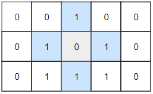

# [1254. Number of Closed Islands](https://leetcode.com/problems/number-of-closed-islands)

[中文文档](/solution/1200-1299/1254.Number%20of%20Closed%20Islands/README.md)

## Description

<p>Given a 2D&nbsp;<code>grid</code> consists of <code>0s</code> (land)&nbsp;and <code>1s</code> (water).&nbsp; An <em>island</em> is a maximal 4-directionally connected group of <code><font face="monospace">0</font>s</code> and a <em>closed island</em>&nbsp;is an island <strong>totally</strong>&nbsp;(all left, top, right, bottom) surrounded by <code>1s.</code></p>

<p>Return the number of <em>closed islands</em>.</p>

<p>&nbsp;</p>

<p><strong>Example 1:</strong></p>


<pre>

<strong>Input:</strong> grid = [[1,1,1,1,1,1,1,0],[1,0,0,0,0,1,1,0],[1,0,1,0,1,1,1,0],[1,0,0,0,0,1,0,1],[1,1,1,1,1,1,1,0]]

<strong>Output:</strong> 2

<strong>Explanation:</strong> 

Islands in gray are closed because they are completely surrounded by water (group of 1s).</pre>

<p><strong>Example 2:</strong></p>



<pre>

<strong>Input:</strong> grid = [[0,0,1,0,0],[0,1,0,1,0],[0,1,1,1,0]]

<strong>Output:</strong> 1

</pre>

<p><strong>Example 3:</strong></p>

<pre>

<strong>Input:</strong> grid = [[1,1,1,1,1,1,1],

&nbsp;              [1,0,0,0,0,0,1],

&nbsp;              [1,0,1,1,1,0,1],

&nbsp;              [1,0,1,0,1,0,1],

&nbsp;              [1,0,1,1,1,0,1],

&nbsp;              [1,0,0,0,0,0,1],

               [1,1,1,1,1,1,1]]

<strong>Output:</strong> 2

</pre>

<p>&nbsp;</p>

<p><strong>Constraints:</strong></p>

<ul>
	<li><code>1 &lt;= grid.length, grid[0].length &lt;= 100</code></li>
	<li><code>0 &lt;= grid[i][j] &lt;=1</code></li>
</ul>

## Solutions

<!-- tabs:start -->

### **Python3**

```python

```

### **Java**

```java

```

### **...**

```

```

<!-- tabs:end -->
