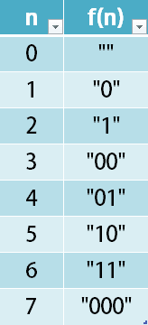

# [1256. Encode Number](https://leetcode.com/problems/encode-number)

[中文文档](/solution/1200-1299/1256.Encode%20Number/README.md)

## Description

<p>Given a non-negative integer <code>num</code>, Return its <em>encoding</em> string.</p>

<p>The encoding is done by converting the integer to a string using a secret function that you should deduce from the following table:</p>



<p> </p>
<p><strong>Example 1:</strong></p>

<pre>
<strong>Input:</strong> num = 23
<strong>Output:</strong> "1000"
</pre>

<p><strong>Example 2:</strong></p>

<pre>
<strong>Input:</strong> num = 107
<strong>Output:</strong> "101100"
</pre>

<p> </p>
<p><strong>Constraints:</strong></p>

<ul>
	<li><code>0 <= num <= 10^9</code></li>
</ul>

## Solutions

<!-- tabs:start -->

### **Python3**

```python

```

### **Java**

```java

```

### **...**

```

```

<!-- tabs:end -->
