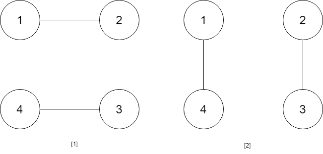

# [1259. Handshakes That Don't Cross](https://leetcode.com/problems/handshakes-that-dont-cross)

[中文文档](/solution/1200-1299/1259.Handshakes%20That%20Don't%20Cross/README.md)

## Description

<p>You are given an <strong>even</strong> number of people <code>num_people</code> that stand around a circle and each person shakes hands with someone else, so that there are <code>num_people / 2</code> handshakes total.</p>

<p>Return the number of ways these handshakes could occur such that none of the handshakes cross.</p>

<p>Since this number could be very big, return the answer <strong>mod <code>10^9 + 7</code></strong></p>

<p> </p>
<p><strong>Example 1:</strong></p>

<pre>
<strong>Input:</strong> num_people = 2
<strong>Output:</strong> 1
</pre>

<p><strong>Example 2:</strong></p>



<pre>
<strong>Input:</strong> num_people = 4
<strong>Output:</strong> 2
<strong>Explanation:</strong> There are two ways to do it, the first way is [(1,2),(3,4)] and the second one is [(2,3),(4,1)].
</pre>

<p><strong>Example 3:</strong></p>


<pre>
<strong>Input:</strong> num_people = 6
<strong>Output:</strong> 5
</pre>

<p><strong>Example 4:</strong></p>

<pre>
<strong>Input:</strong> num_people = 8
<strong>Output:</strong> 14
</pre>

<p> </p>
<p><strong>Constraints:</strong></p>

<ul>
	<li><code>2 <= num_people <= 1000</code></li>
	<li><code>num_people % 2 == 0</code></li>
</ul>

## Solutions

<!-- tabs:start -->

### **Python3**

```python

```

### **Java**

```java

```

### **...**

```

```

<!-- tabs:end -->
