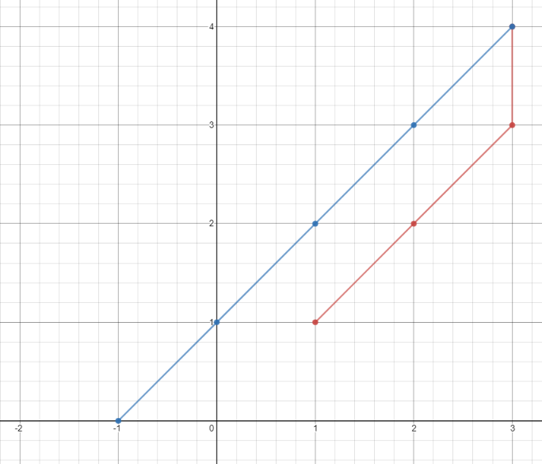

# [1266. 访问所有点的最小时间](https://leetcode-cn.com/problems/minimum-time-visiting-all-points)

[English Version](/solution/1200-1299/1266.Minimum%20Time%20Visiting%20All%20Points/README_EN.md)

## 题目描述

<!-- 这里写题目描述 -->
<p>平面上有&nbsp;<code>n</code>&nbsp;个点，点的位置用整数坐标表示&nbsp;<code>points[i] = [xi, yi]</code>。请你计算访问所有这些点需要的最小时间（以秒为单位）。</p>

<p>你可以按照下面的规则在平面上移动：</p>

<ul>
	<li>每一秒沿水平或者竖直方向移动一个单位长度，或者跨过对角线（可以看作在一秒内向水平和竖直方向各移动一个单位长度）。</li>
	<li>必须按照数组中出现的顺序来访问这些点。</li>
</ul>

<p>&nbsp;</p>

<p><strong>示例 1：</strong></p>



<pre><strong>输入：</strong>points = [[1,1],[3,4],[-1,0]]
<strong>输出：</strong>7
<strong>解释：</strong>一条最佳的访问路径是： <strong>[1,1]</strong> -&gt; [2,2] -&gt; [3,3] -&gt; <strong>[3,4] </strong>-&gt; [2,3] -&gt; [1,2] -&gt; [0,1] -&gt; <strong>[-1,0]</strong>   
从 [1,1] 到 [3,4] 需要 3 秒 
从 [3,4] 到 [-1,0] 需要 4 秒
一共需要 7 秒</pre>

<p><strong>示例 2：</strong></p>

<pre><strong>输入：</strong>points = [[3,2],[-2,2]]
<strong>输出：</strong>5
</pre>

<p>&nbsp;</p>

<p><strong>提示：</strong></p>

<ul>
	<li><code>points.length == n</code></li>
	<li><code>1 &lt;= n&nbsp;&lt;= 100</code></li>
	<li><code>points[i].length == 2</code></li>
	<li><code>-1000&nbsp;&lt;= points[i][0], points[i][1]&nbsp;&lt;= 1000</code></li>
</ul>

## 解法

<!-- 这里可写通用的实现逻辑 -->

<!-- tabs:start -->

### **Python3**

<!-- 这里可写当前语言的特殊实现逻辑 -->

```python

```

### **Java**

<!-- 这里可写当前语言的特殊实现逻辑 -->

```java

```

### **...**

```

```

<!-- tabs:end -->
