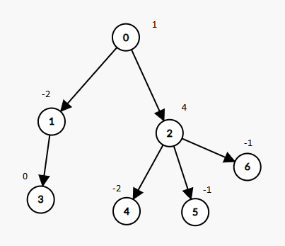

# [1273. Delete Tree Nodes](https://leetcode.com/problems/delete-tree-nodes)

[中文文档](/solution/1200-1299/1273.Delete%20Tree%20Nodes/README.md)

## Description

<p>A tree rooted at node 0 is given as follows:</p>

<ul>
	<li>The number of nodes is <code>nodes</code>;</li>
	<li>The value of the <code>i</code>-th node is <code>value[i]</code>;</li>
	<li>The parent of the <code>i</code>-th node is <code>parent[i]</code>.</li>
</ul>

<p>Remove every subtree whose sum of values of nodes is zero.</p>

<p>After doing so, return the number of nodes remaining in the tree.</p>

<p> </p>
<p><strong>Example 1:</strong></p>



<pre>
<strong>Input:</strong> nodes = 7, parent = [-1,0,0,1,2,2,2], value = [1,-2,4,0,-2,-1,-1]
<strong>Output:</strong> 2
</pre>

<p> </p>
<p><strong>Constraints:</strong></p>

<ul>
	<li><code>1 <= nodes <= 10^4</code></li>
	<li><code>-10^5 <= value[i] <= 10^5</code></li>
	<li><code>parent.length == nodes</code></li>
	<li><code>parent[0] == -1</code> which indicates that <code>0</code> is the root.</li>
</ul>

## Solutions

<!-- tabs:start -->

### **Python3**

```python

```

### **Java**

```java

```

### **...**

```

```

<!-- tabs:end -->
