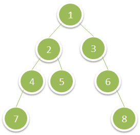

# [1302. Deepest Leaves Sum](https://leetcode.com/problems/deepest-leaves-sum)

[中文文档](/solution/1300-1399/1302.Deepest%20Leaves%20Sum/README.md)

## Description
Given a binary tree, return the sum of values of its deepest leaves.

<p>&nbsp;</p>

<p><strong>Example 1:</strong></p>




<pre>

<strong>Input:</strong> root = [1,2,3,4,5,null,6,7,null,null,null,null,8]

<strong>Output:</strong> 15

</pre>


<p>&nbsp;</p>

<p><strong>Constraints:</strong></p>


<ul>
	<li>The number of nodes in the tree is between&nbsp;<code>1</code>&nbsp;and&nbsp;<code>10^4</code>.</li>
	<li>The value of nodes is between&nbsp;<code>1</code>&nbsp;and&nbsp;<code>100</code>.</li>
</ul>


## Solutions


<!-- tabs:start -->

### **Python3**

```python

```

### **Java**

```java

```

### **...**
```

```

<!-- tabs:end -->