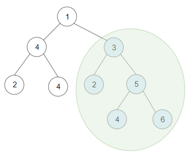
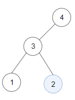

# [1373. 二叉搜索子树的最大键值和](https://leetcode-cn.com/problems/maximum-sum-bst-in-binary-tree)

[English Version](/solution/1300-1399/1373.Maximum%20Sum%20BST%20in%20Binary%20Tree/README_EN.md)

## 题目描述

<!-- 这里写题目描述 -->
<p>给你一棵以&nbsp;<code>root</code>&nbsp;为根的&nbsp;<strong>二叉树</strong>&nbsp;，请你返回 <strong>任意</strong>&nbsp;二叉搜索子树的最大键值和。</p>

<p>二叉搜索树的定义如下：</p>

<ul>
	<li>任意节点的左子树中的键值都&nbsp;<strong>小于</strong>&nbsp;此节点的键值。</li>
	<li>任意节点的右子树中的键值都 <strong>大于</strong>&nbsp;此节点的键值。</li>
	<li>任意节点的左子树和右子树都是二叉搜索树。</li>
</ul>

<p>&nbsp;</p>

<p><strong>示例 1：</strong></p>



<pre><strong>输入：</strong>root = [1,4,3,2,4,2,5,null,null,null,null,null,null,4,6]
<strong>输出：</strong>20
<strong>解释：</strong>键值为 3 的子树是和最大的二叉搜索树。
</pre>

<p><strong>示例 2：</strong></p>



<pre><strong>输入：</strong>root = [4,3,null,1,2]
<strong>输出：</strong>2
<strong>解释：</strong>键值为 2 的单节点子树是和最大的二叉搜索树。
</pre>

<p><strong>示例 3：</strong></p>

<pre><strong>输入：</strong>root = [-4,-2,-5]
<strong>输出：</strong>0
<strong>解释：</strong>所有节点键值都为负数，和最大的二叉搜索树为空。
</pre>

<p><strong>示例 4：</strong></p>

<pre><strong>输入：</strong>root = [2,1,3]
<strong>输出：</strong>6
</pre>

<p><strong>示例 5：</strong></p>

<pre><strong>输入：</strong>root = [5,4,8,3,null,6,3]
<strong>输出：</strong>7
</pre>

<p>&nbsp;</p>

<p><strong>提示：</strong></p>

<ul>
	<li>每棵树最多有&nbsp;<code>40000</code>&nbsp;个节点。</li>
	<li>每个节点的键值在&nbsp;<code>[-4 * 10^4&nbsp;, 4 * 10^4]</code> 之间。</li>
</ul>

## 解法

<!-- 这里可写通用的实现逻辑 -->

<!-- tabs:start -->

### **Python3**

<!-- 这里可写当前语言的特殊实现逻辑 -->

```python

```

### **Java**

<!-- 这里可写当前语言的特殊实现逻辑 -->

```java

```

### **...**

```

```

<!-- tabs:end -->
