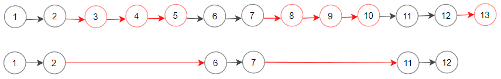
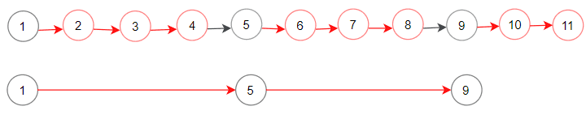

# [1474. 删除链表 M 个节点之后的 N 个节点](https://leetcode-cn.com/problems/delete-n-nodes-after-m-nodes-of-a-linked-list)

[English Version](/solution/1400-1499/1474.Delete%20N%20Nodes%20After%20M%20Nodes%20of%20a%20Linked%20List/README_EN.md)

## 题目描述

<!-- 这里写题目描述 -->

<p>给定链表 <code>head</code> 和两个整数 <code>m</code> 和 <code>n</code>. 遍历该链表并按照如下方式删除节点:</p>

<ul>
	<li>开始时以头节点作为当前节点.</li>
	<li>保留以当前节点开始的前 <code>m</code> 个节点.</li>
	<li>删除接下来的 <code>n</code> 个节点.</li>
	<li>重复步骤 2 和 3, 直到到达链表结尾.</li>
</ul>

<p>在删除了指定结点之后, 返回修改过后的链表的头节点.</p>

<p><strong>进阶问题:</strong> 你能通过<strong>就地</strong>修改链表的方式解决这个问题吗?</p>

<p> </p>

<p><strong>示例 1:</strong></p>



<pre>
<strong>输入:</strong> head = [1,2,3,4,5,6,7,8,9,10,11,12,13], m = 2, n = 3
<strong>输出:</strong> [1,2,6,7,11,12]
<strong>解析: </strong>保留前(m = 2)个结点,  也就是以黑色节点表示的从链表头结点开始的结点(1 ->2).
删除接下来的(n = 3)个结点(3 -> 4 -> 5), 在图中以红色结点表示.
继续相同的操作, 直到链表的末尾.
返回删除结点之后的链表的头结点.</pre>

<p><strong>示例 2:</strong></p>



<pre>
<strong>输入:</strong> head = [1,2,3,4,5,6,7,8,9,10,11], m = 1, n = 3
<strong>输出:</strong> [1,5,9]
<strong>解析:</strong> 返回删除结点之后的链表的头结点.</pre>

<p><strong>示例 3:</strong></p>

<pre>
<strong>输入:</strong> head = [1,2,3,4,5,6,7,8,9,10,11], m = 3, n = 1
<strong>输出:</strong> [1,2,3,5,6,7,9,10,11]
</pre>

<p><strong>示例 4:</strong></p>

<pre>
<strong>输入:</strong> head = [9,3,7,7,9,10,8,2], m = 1, n = 2
<strong>输出:</strong> [9,7,8]
</pre>

<p> </p>

<p><strong>提示:</strong></p>

<ul>
	<li> <code>1 <= 链表结点数 <= 10^4</code></li>
	<li><code>[1 <= 链表的每一个结点值 <=10^6]</code></li>
	<li><code>1 <= m,n <= 1000</code></li>
</ul>


## 解法

<!-- 这里可写通用的实现逻辑 -->

<!-- tabs:start -->

### **Python3**

<!-- 这里可写当前语言的特殊实现逻辑 -->

```python

```

### **Java**

<!-- 这里可写当前语言的特殊实现逻辑 -->

```java

```

### **...**

```

```

<!-- tabs:end -->
