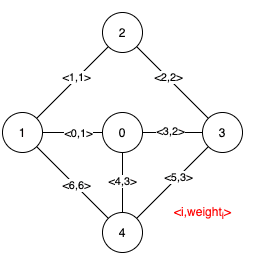
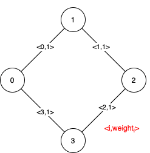

# [1489. Find Critical and Pseudo-Critical Edges in Minimum Spanning Tree](https://leetcode.com/problems/find-critical-and-pseudo-critical-edges-in-minimum-spanning-tree)

[中文文档](/solution/1400-1499/1489.Find%20Critical%20and%20Pseudo-Critical%20Edges%20in%20Minimum%20Spanning%20Tree/README.md)

## Description

<p>Given a weighted undirected connected graph with <code>n</code>&nbsp;vertices numbered from <code>0</code> to <code>n-1</code>,&nbsp;and an array <code>edges</code>&nbsp;where <code>edges[i] = [from<sub>i</sub>, to<sub>i</sub>, weight<sub>i</sub>]</code> represents a bidirectional and weighted edge between nodes&nbsp;<code>from<sub>i</sub></code>&nbsp;and <code>to<sub>i</sub></code>. A minimum spanning tree (MST) is a subset of the edges of the graph that connects all vertices without cycles&nbsp;and with the minimum possible total edge weight.</p>

<p>Find <em>all the critical and pseudo-critical edges in the minimum spanning tree (MST) of the given graph</em>. An MST edge whose deletion from the graph would cause the MST weight to increase is called a&nbsp;<em>critical edge</em>. A <em>pseudo-critical edge</em>, on the other hand, is that which can appear in some MSTs but not all.</p>

<p>Note that you can return the indices of the edges in any order.</p>

<p>&nbsp;</p>
<p><strong>Example 1:</strong></p>



<pre>
<strong>Input:</strong> n = 5, edges = [[0,1,1],[1,2,1],[2,3,2],[0,3,2],[0,4,3],[3,4,3],[1,4,6]]
<strong>Output:</strong> [[0,1],[2,3,4,5]]
<strong>Explanation:</strong> The figure above describes the graph.
The following figure shows all the possible MSTs:


Notice that the two edges 0 and 1 appear in all MSTs, therefore they are critical edges, so we return them in the first list of the output.
The edges 2, 3, 4, and 5 are only part of some MSTs, therefore they are considered pseudo-critical edges. We add them to the second list of the output.
</pre>

<p><strong>Example 2:</strong></p>



<pre>
<strong>Input:</strong> n = 4, edges = [[0,1,1],[1,2,1],[2,3,1],[0,3,1]]
<strong>Output:</strong> [[],[0,1,2,3]]
<strong>Explanation:</strong> We can observe that since all 4 edges have equal weight, choosing any 3 edges from the given 4 will yield an MST. Therefore all 4 edges are pseudo-critical.
</pre>

<p>&nbsp;</p>
<p><strong>Constraints:</strong></p>

<ul>
	<li><code>2 &lt;= n &lt;= 100</code></li>
	<li><code>1 &lt;= edges.length &lt;= min(200, n * (n - 1) / 2)</code></li>
	<li><code>edges[i].length == 3</code></li>
	<li><code>0 &lt;= from<sub>i</sub> &lt; to<sub>i</sub> &lt; n</code></li>
	<li><code>1 &lt;= weight<sub>i</sub>&nbsp;&lt;= 1000</code></li>
	<li>All pairs <code>(from<sub>i</sub>, to<sub>i</sub>)</code> are distinct.</li>
</ul>


## Solutions


<!-- tabs:start -->

### **Python3**


```python

```

### **Java**


```java

```

### **...**
```

```

<!-- tabs:end -->