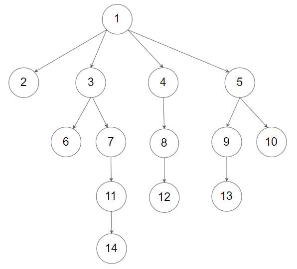

# [1490. 克隆 N 叉树](https://leetcode-cn.com/problems/clone-n-ary-tree)

[English Version](/solution/1400-1499/1490.Clone%20N-ary%20Tree/README_EN.md)

## 题目描述

<!-- 这里写题目描述 -->

<p>给定一棵 N 叉树的根节点&nbsp;<code>root</code>&nbsp;，返回该树的<a href="https://baike.baidu.com/item/深拷贝/22785317?fr=aladdin"><strong>深拷贝</strong></a>（克隆）。</p>

<p>N 叉树的每个节点都包含一个值（ <code>int</code>&nbsp;）和子节点的列表（ <code>List[Node]</code>&nbsp;）。</p>

<pre>
class Node {
    public int val;
    public List&lt;Node&gt; children;
}
</pre>

<p><em>N 叉树的输入序列用层序遍历表示，每组子节点用 null 分隔（见示例）。</em></p>

<p><strong>进阶：</strong>你的答案可以适用于<a href="https://leetcode-cn.com/problems/clone-graph/">克隆图</a>问题吗？</p>

<p>&nbsp;</p>

<p><strong>示例 1：</strong></p>


<pre>
<strong>输入：</strong>root = [1,null,3,2,4,null,5,6]
<strong>输出：</strong>[1,null,3,2,4,null,5,6]
</pre>

<p><strong>示例 2：</strong></p>



<pre>
<strong>输入：</strong>root = [1,null,2,3,4,5,null,null,6,7,null,8,null,9,10,null,null,11,null,12,null,13,null,null,14]
<strong>输出：</strong>[1,null,2,3,4,5,null,null,6,7,null,8,null,9,10,null,null,11,null,12,null,13,null,null,14]
</pre>

<p>&nbsp;</p>

<p><strong>提示：</strong></p>

<ul>
	<li>给定的 N 叉树的深度小于或等于&nbsp;<code>1000</code>。</li>
	<li>节点的总个数在&nbsp;<code>[0,&nbsp;10^4]</code>&nbsp;之间</li>
</ul>


## 解法

<!-- 这里可写通用的实现逻辑 -->

<!-- tabs:start -->

### **Python3**

<!-- 这里可写当前语言的特殊实现逻辑 -->

```python

```

### **Java**

<!-- 这里可写当前语言的特殊实现逻辑 -->

```java

```

### **...**

```

```

<!-- tabs:end -->
