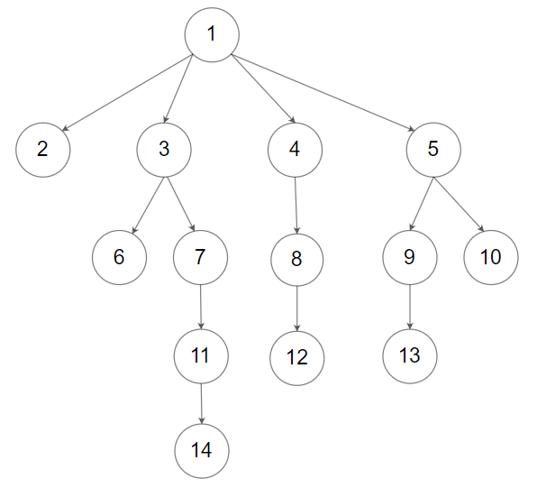
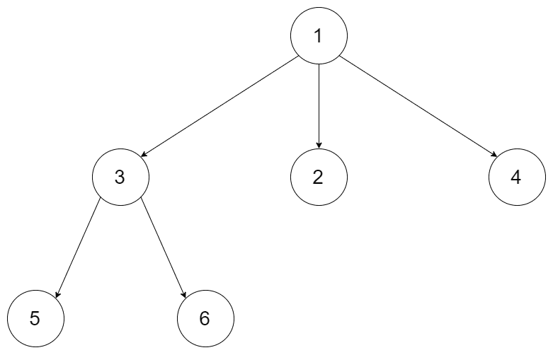

# [1506. 找到 N 叉树的根节点](https://leetcode-cn.com/problems/find-root-of-n-ary-tree)

[English Version](/solution/1500-1599/1506.Find%20Root%20of%20N-Ary%20Tree/README_EN.md)

## 题目描述

<!-- 这里写题目描述 -->

<p>给定一棵 <a href="https://slack-redir.net/link?url=https%3A%2F%2Fleetcode.com%2Farticles%2Fintroduction-to-n-ary-trees" target="_blank">N 叉树</a> 的所有节点在一个数组  <code>Node[] tree</code> 中，树中每个节点都有 <strong>唯一的值</strong> 。</p>

<p>找到并返回 N 叉树的 <strong>根节点 </strong>。</p>

<p> </p>

<p><strong>自定义测试：</strong></p>

<p><em>N 叉树的输入序列为其层序遍历序列，每组子节点用 null 分隔（见示例）。</em></p>



<p>上图中的 N 叉树的序列化描述为 <code>[1,null,2,3,4,5,null,null,6,7,null,8,null,9,10,null,null,11,null,12,null,13,null,null,14]</code> 。</p>

<p><strong>测试将以下列方式进行：</strong></p>

<ul>
	<li>输入数据的形式为树的序列化描述。</li>
	<li>驱动程序代码将根据序列化的输入数据构造树，并以任意顺序将每个 <code>Node</code> 对象放入一个数组中。</li>
	<li>驱动程序代码将把数组传递给 <code>findRoot</code> ，你所编写的函数应该在数组中查找并返回根 <code>Node</code> 对象。</li>
	<li>驱动程序代码将接受返回的 <code>Node</code> 对象并对其进行序列化。如果序列化的结果和输入数据 <strong>相同</strong> ，则测试 <strong>通过</strong> 。</li>
</ul>

<p> </p>

<p><strong>示例 1：</strong></p>



<pre>
<strong>输入：</strong>tree = [1,null,3,2,4,null,5,6]
<strong>输出：</strong>[1,null,3,2,4,null,5,6]
<strong>解释：</strong>来自输入数据的树如上所示。
驱动程序代码创建树，并以任意顺序向 findRoot 提供 Node 对象。
例如，传递的数组可以是 [Node(5),Node(4),Node(3),Node(6),Node(2),Node(1)] 或 [Node(2),Node(6),Node(1),Node(3),Node(5),Node(4)] 。
findRoot 函数应该返回根 Node(1) ，驱动程序代码将序列化它并与输入数据进行比较。
输入数据和序列化的 Node(1) 相同，因此测试通过。</pre>

<p><strong>示例 2：</strong></p>


<pre>
<strong>输入：</strong>tree = [1,null,2,3,4,5,null,null,6,7,null,8,null,9,10,null,null,11,null,12,null,13,null,null,14]
<strong>输出：</strong>[1,null,2,3,4,5,null,null,6,7,null,8,null,9,10,null,null,11,null,12,null,13,null,null,14]
</pre>

<p> </p>

<p><strong>提示：</strong></p>

<ul>
	<li>节点的总个数在 <code>[1, 5*10^4]</code> 之间。</li>
	<li>每个节点都有唯一的值。</li>
</ul>

<p> </p>

<p><strong>进阶：</strong></p>

<ul>
	<li>你可以使用 O(1) 额外内存空间且 O(n) 时间复杂度的算法来找到该树的根节点吗？</li>
</ul>


## 解法

<!-- 这里可写通用的实现逻辑 -->

<!-- tabs:start -->

### **Python3**

<!-- 这里可写当前语言的特殊实现逻辑 -->

```python

```

### **Java**

<!-- 这里可写当前语言的特殊实现逻辑 -->

```java

```

### **...**

```

```

<!-- tabs:end -->
