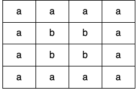
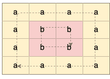
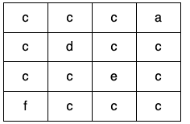
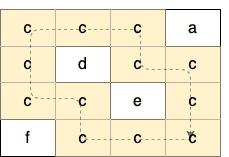

# [1559. Detect Cycles in 2D Grid](https://leetcode.com/problems/detect-cycles-in-2d-grid)

[中文文档](/solution/1500-1599/1559.Detect%20Cycles%20in%202D%20Grid/README.md)

## Description

<p>Given a 2D array of characters&nbsp;<code>grid</code>&nbsp;of size <code>m x n</code>, you need to find if there exists any cycle consisting of the <strong>same value</strong>&nbsp;in&nbsp;<code>grid</code>.</p>

<p>A cycle is a path of <strong>length 4&nbsp;or more</strong>&nbsp;in the grid that starts and ends at the same cell. From a given cell, you can move to one of the cells adjacent to it - in one of the four directions (up, down, left, or right), if it has the <strong>same value</strong> of the current cell.</p>

<p>Also, you cannot move to the cell that you visited in your last move. For example, the cycle&nbsp;<code>(1, 1) -&gt; (1, 2) -&gt; (1, 1)</code>&nbsp;is invalid because from&nbsp;<code>(1, 2)</code>&nbsp;we visited&nbsp;<code>(1, 1)</code>&nbsp;which was the last visited cell.</p>

<p>Return&nbsp;<code>true</code>&nbsp;if any cycle of the same value exists in&nbsp;<code>grid</code>, otherwise, return&nbsp;<code>false</code>.</p>

<p>&nbsp;</p>
<p><strong>Example 1:</strong></p>



<pre>
<strong>Input:</strong> grid = [[&quot;a&quot;,&quot;a&quot;,&quot;a&quot;,&quot;a&quot;],[&quot;a&quot;,&quot;b&quot;,&quot;b&quot;,&quot;a&quot;],[&quot;a&quot;,&quot;b&quot;,&quot;b&quot;,&quot;a&quot;],[&quot;a&quot;,&quot;a&quot;,&quot;a&quot;,&quot;a&quot;]]
<strong>Output:</strong> true
<strong>Explanation: </strong>There are two valid cycles shown in different colors in the image below:
</pre>



<p><strong>Example 2:</strong></p>



<pre>
<strong>Input:</strong> grid = [[&quot;c&quot;,&quot;c&quot;,&quot;c&quot;,&quot;a&quot;],[&quot;c&quot;,&quot;d&quot;,&quot;c&quot;,&quot;c&quot;],[&quot;c&quot;,&quot;c&quot;,&quot;e&quot;,&quot;c&quot;],[&quot;f&quot;,&quot;c&quot;,&quot;c&quot;,&quot;c&quot;]]
<strong>Output:</strong> true
<strong>Explanation: </strong>There is only one valid cycle highlighted in the image below:
</pre>



<p><strong>Example 3:</strong></p>


<pre>
<strong>Input:</strong> grid = [[&quot;a&quot;,&quot;b&quot;,&quot;b&quot;],[&quot;b&quot;,&quot;z&quot;,&quot;b&quot;],[&quot;b&quot;,&quot;b&quot;,&quot;a&quot;]]
<strong>Output:</strong> false
</pre>

<p>&nbsp;</p>
<p><strong>Constraints:</strong></p>

<ul>
	<li><code>m == grid.length</code></li>
	<li><code>n == grid[i].length</code></li>
	<li><code>1 &lt;= m &lt;= 500</code></li>
	<li><code>1 &lt;= n &lt;= 500</code></li>
	<li><code>grid</code>&nbsp;consists only of lowercase&nbsp;English letters.</li>
</ul>

## Solutions

<!-- tabs:start -->

### **Python3**

```python

```

### **Java**

```java

```

### **...**

```

```

<!-- tabs:end -->
