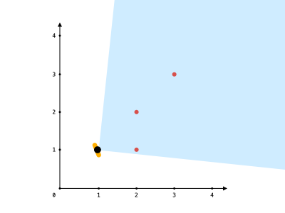
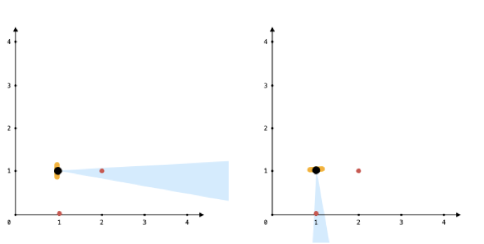

# [1610. 可见点的最大数目](https://leetcode-cn.com/problems/maximum-number-of-visible-points)

[English Version](/solution/1600-1600/1610.Maximum%20Number%20of%20Visible%20Points/README_EN.md)

## 题目描述

<!-- 这里写题目描述 -->

<p>给你一个点数组 <code>points</code> 和一个表示角度的整数 <code>angle</code> ，你的位置是 <code>location</code> ，其中 <code>location = [pos<sub>x</sub>, pos<sub>y</sub>]</code> 且 <code>points[i] = [x<sub>i</sub>, y<sub>i</sub>]</code> 都表示 X-Y 平面上的整数坐标。</p>

<p>最开始，你面向东方进行观测。你 <strong>不能</strong> 进行移动改变位置，但可以通过 <strong>自转</strong> 调整观测角度。换句话说，<code>pos<sub>x</sub></code> 和 <code>pos<sub>y</sub></code> 不能改变。你的视野范围的角度用 <code>angle</code> 表示， 这决定了你观测任意方向时可以多宽。设 <code>d</code> 为你逆时针自转旋转的度数，那么你的视野就是角度范围 <code>[d - angle/2, d + angle/2]</code> 所指示的那片区域。</p>

<video autoplay="" controls="" height="360" muted="" style="max-width:100%;height:auto;" width="750"><source src="https://assets.leetcode-cn.com/aliyun-lc-upload/uploads/2020/10/04/angle.mp4" type="video/mp4" />Your browser does not support the video tag or this video format.</video>

<p>对于每个点，如果由该点、你的位置以及从你的位置直接向东的方向形成的角度 <strong>位于你的视野中</strong> ，那么你就可以看到它。</p>

<p>同一个坐标上可以有多个点。你所在的位置也可能存在一些点，但不管你的怎么旋转，总是可以看到这些点。同时，点不会阻碍你看到其他点。</p>

<p>返回你能看到的点的最大数目。</p>

<p> </p>

<p><strong>示例 1：</strong></p>



<pre>
<strong>输入：</strong>points = [[2,1],[2,2],[3,3]], angle = 90, location = [1,1]
<strong>输出：</strong>3
<strong>解释：</strong>阴影区域代表你的视野。在你的视野中，所有的点都清晰可见，尽管 [2,2] 和 [3,3]在同一条直线上，你仍然可以看到 [3,3] 。</pre>

<p><strong>示例 2：</strong></p>

<pre>
<strong>输入：</strong>points = [[2,1],[2,2],[3,4],[1,1]], angle = 90, location = [1,1]
<strong>输出：</strong>4
<strong>解释：</strong>在你的视野中，所有的点都清晰可见，包括你所在位置的那个点。</pre>

<p><strong>示例 3：</strong></p>



<pre>
<strong>输入：</strong>points = [[1,0],[2,1]], angle = 13, location = [1,1]
<strong>输出：</strong>1
<strong>解释：</strong>如图所示，你只能看到两点之一。</pre>

<p> </p>

<p><strong>提示：</strong></p>

<ul>
	<li><code>1 <= points.length <= 10<sup>5</sup></code></li>
	<li><code>points[i].length == 2</code></li>
	<li><code>location.length == 2</code></li>
	<li><code>0 <= angle < 360</code></li>
	<li><code>0 <= pos<sub>x</sub>, pos<sub>y</sub>, x<sub>i</sub>, y<sub>i</sub> <= 100</code></li>
</ul>

## 解法

<!-- 这里可写通用的实现逻辑 -->

<!-- tabs:start -->

### **Python3**

<!-- 这里可写当前语言的特殊实现逻辑 -->

```python

```

### **Java**

<!-- 这里可写当前语言的特殊实现逻辑 -->

```java

```

### **...**

```

```

<!-- tabs:end -->
