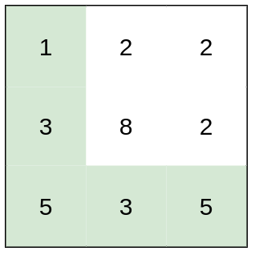
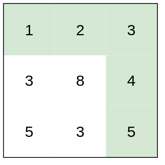
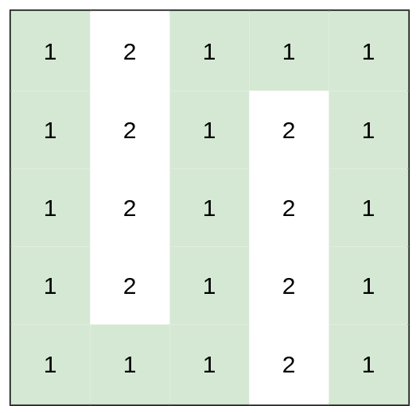

# [1631. Path With Minimum Effort](https://leetcode.com/problems/path-with-minimum-effort)

[中文文档](/solution/1600-1600/1631.Path%20With%20Minimum%20Effort/README.md)

## Description

<p>You are a hiker preparing for an upcoming hike. You are given <code>heights</code>, a 2D array of size <code>rows x columns</code>, where <code>heights[row][col]</code> represents the height of cell <code>(row, col)</code>. You are situated in the top-left cell, <code>(0, 0)</code>, and you hope to travel to the bottom-right cell, <code>(rows-1, columns-1)</code> (i.e.,&nbsp;<strong>0-indexed</strong>). You can move <strong>up</strong>, <strong>down</strong>, <strong>left</strong>, or <strong>right</strong>, and you wish to find a route that requires the minimum <strong>effort</strong>.</p>

<p>A route&#39;s <strong>effort</strong> is the <strong>maximum absolute difference</strong><strong> </strong>in heights between two consecutive cells of the route.</p>

<p>Return <em>the minimum <strong>effort</strong> required to travel from the top-left cell to the bottom-right cell.</em></p>

<p>&nbsp;</p>
<p><strong>Example 1:</strong></p>



<pre>
<strong>Input:</strong> heights = [[1,2,2],[3,8,2],[5,3,5]]
<strong>Output:</strong> 2
<strong>Explanation:</strong> The route of [1,3,5,3,5] has a maximum absolute difference of 2 in consecutive cells.
This is better than the route of [1,2,2,2,5], where the maximum absolute difference is 3.
</pre>

<p><strong>Example 2:</strong></p>



<pre>
<strong>Input:</strong> heights = [[1,2,3],[3,8,4],[5,3,5]]
<strong>Output:</strong> 1
<strong>Explanation:</strong> The route of [1,2,3,4,5] has a maximum absolute difference of 1 in consecutive cells, which is better than route [1,3,5,3,5].
</pre>

<p><strong>Example 3:</strong></p>



<pre>
<strong>Input:</strong> heights = [[1,2,1,1,1],[1,2,1,2,1],[1,2,1,2,1],[1,2,1,2,1],[1,1,1,2,1]]
<strong>Output:</strong> 0
<strong>Explanation:</strong> This route does not require any effort.
</pre>

<p>&nbsp;</p>
<p><strong>Constraints:</strong></p>

<ul>
	<li><code>rows == heights.length</code></li>
	<li><code>columns == heights[i].length</code></li>
	<li><code>1 &lt;= rows, columns &lt;= 100</code></li>
	<li><code>1 &lt;= heights[i][j] &lt;= 10<sup>6</sup></code></li>
</ul>


## Solutions

<!-- tabs:start -->

### **Python3**

```python

```

### **Java**

```java

```

### **...**

```

```

<!-- tabs:end -->
