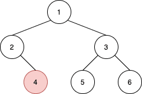
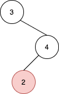

# [1602. Find Nearest Right Node in Binary Tree](https://leetcode.com/problems/find-nearest-right-node-in-binary-tree)

[中文文档](/solution/1600-1699/1602.Find%20Nearest%20Right%20Node%20in%20Binary%20Tree/README.md)

## Description

<p>Given the <code>root</code> of a binary tree and a node <code>u</code> in the tree, return <em>the <strong>nearest</strong> node on the <strong>same level</strong> that is to the <strong>right</strong> of</em> <code>u</code><em>, or return</em> <code>null</code> <em>if </em><code>u</code> <em>is the rightmost node in its level</em>.</p>

<p>&nbsp;</p>
<p><strong>Example 1:</strong></p>



<pre>
<strong>Input:</strong> root = [1,2,3,null,4,5,6], u = 4
<strong>Output:</strong> 5
<strong>Explanation: </strong>The nearest node on the same level to the right of node 4 is node 5.
</pre>

<p><strong>Example 2:</strong></p>



<pre>
<strong>Input:</strong> root = [3,null,4,2], u = 2
<strong>Output:</strong> null
<strong>Explanation: </strong>There are no nodes to the right of 2.
</pre>

<p><strong>Example 3:</strong></p>

<pre>
<strong>Input:</strong> root = [1], u = 1
<strong>Output:</strong> null
</pre>

<p><strong>Example 4:</strong></p>

<pre>
<strong>Input:</strong> root = [3,4,2,null,null,null,1], u = 4
<strong>Output:</strong> 2
</pre>

<p>&nbsp;</p>
<p><strong>Constraints:</strong></p>

<ul>
	<li>The number of nodes in the tree is in the range <code>[1, 10<sup>5</sup>]</code>.</li>
	<li><code>1 &lt;= Node.val &lt;= 10<sup>5</sup></code></li>
	<li>All values in the tree are <strong>distinct</strong>.</li>
	<li><code>u</code> is a node in the binary tree rooted at <code>root</code>.</li>
</ul>


## Solutions

<!-- tabs:start -->

### **Python3**

```python

```

### **Java**

```java

```

### **...**

```

```

<!-- tabs:end -->
