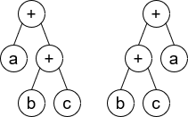
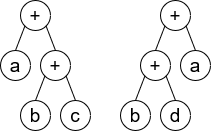

# [1612. Check If Two Expression Trees are Equivalent](https://leetcode.com/problems/check-if-two-expression-trees-are-equivalent)

[中文文档](/solution/1600-1699/1612.Check%20If%20Two%20Expression%20Trees%20are%20Equivalent/README.md)

## Description

<p>A <strong><a href="https://en.wikipedia.org/wiki/Binary_expression_tree" target="_blank">binary expression tree</a></strong> is a kind of binary tree used to represent arithmetic expressions. Each node of a binary expression tree has either zero or two children. Leaf nodes (nodes with 0 children) correspond to operands (variables), and internal nodes (nodes with two children) correspond to the operators. In this problem, we only consider the <code>&#39;+&#39;</code> operator (i.e. addition).</p>

<p>You are given the roots of two binary expression trees, <code>root1</code> and <code>root2</code>. Return <code>true</code><em> if the two binary expression trees are equivalent</em>. Otherwise, return <code>false</code>.</p>

<p>Two binary expression trees are equivalent if they <strong>evaluate to the same value</strong> regardless of what the variables are set to.</p>

<p><strong>Follow up:</strong> What will you change in your solution if the tree also supports the <code>&#39;-&#39;</code> operator (i.e. subtraction)?</p>

<p>&nbsp;</p>
<p><strong>Example 1:</strong></p>

<pre>
<strong>Input:</strong> root1 = [x], root2 = [x]
<strong>Output:</strong> true
</pre>

<p><strong>Example 2:</strong></p>



<pre>
<strong>Input:</strong> root1 = [+,a,+,null,null,b,c], root2 = [+,+,a,b,c]
<strong>Output:</strong> true
<strong>Explaination:</strong> <code>a + (b + c) == (b + c) + a</code></pre>

<p><strong>Example 3:</strong></p>



<pre>
<strong>Input:</strong> root1 = [+,a,+,null,null,b,c], root2 = [+,+,a,b,d]
<strong>Output:</strong> false
<strong>Explaination:</strong> <code>a + (b + c) != (b + d) + a</code>
</pre>

<p>&nbsp;</p>
<p><strong>Constraints:</strong></p>

<ul>
	<li>The number of nodes in both trees are equal, odd and, in the range <code>[1, 4999]</code>.</li>
	<li><code>Node.val</code> is <code>&#39;+&#39;</code> or a lower-case English letter.</li>
	<li>It&#39;s <strong>guaranteed</strong> that the tree given is a valid binary expression tree.</li>
</ul>


## Solutions

<!-- tabs:start -->

### **Python3**

```python

```

### **Java**

```java

```

### **...**

```

```

<!-- tabs:end -->
