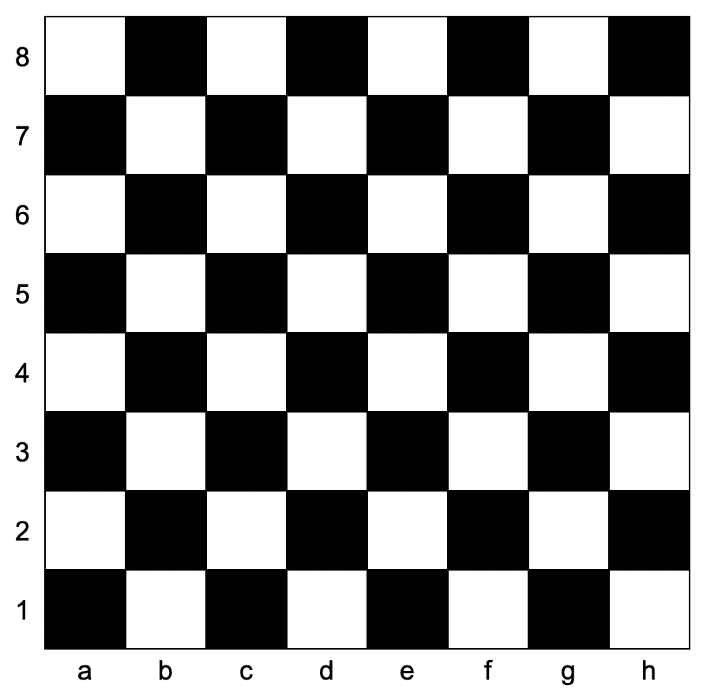

# [1812. 判断国际象棋棋盘中一个格子的颜色](https://leetcode-cn.com/problems/determine-color-of-a-chessboard-square)

[English Version](/solution/1800-1899/1812.Determine%20Color%20of%20a%20Chessboard%20Square/README_EN.md)

## 题目描述

<!-- 这里写题目描述 -->

<p>给你一个坐标 <code>coordinates</code> ，它是一个字符串，表示国际象棋棋盘中一个格子的坐标。下图是国际象棋棋盘示意图。</p>



<p>如果所给格子的颜色是白色，请你返回 <code>true</code>，如果是黑色，请返回 <code>false</code> 。</p>

<p>给定坐标一定代表国际象棋棋盘上一个存在的格子。坐标第一个字符是字母，第二个字符是数字。</p>

<p> </p>

<p><strong>示例 1：</strong></p>

<pre>
<b>输入：</b>coordinates = "a1"
<b>输出：</b>false
<b>解释：</b>如上图棋盘所示，"a1" 坐标的格子是黑色的，所以返回 false 。
</pre>

<p><strong>示例 2：</strong></p>

<pre>
<b>输入：</b>coordinates = "h3"
<b>输出：</b>true
<b>解释：</b>如上图棋盘所示，"h3" 坐标的格子是白色的，所以返回 true 。
</pre>

<p><strong>示例 3：</strong></p>

<pre>
<b>输入：</b>coordinates = "c7"
<b>输出：</b>false
</pre>

<p> </p>

<p><strong>提示：</strong></p>

<ul>
	<li><code>coordinates.length == 2</code></li>
	<li><code>'a' <= coordinates[0] <= 'h'</code></li>
	<li><code>'1' <= coordinates[1] <= '8'</code></li>
</ul>

## 解法

<!-- 这里可写通用的实现逻辑 -->

<!-- tabs:start -->

### **Python3**

<!-- 这里可写当前语言的特殊实现逻辑 -->

```python

```

### **Java**

<!-- 这里可写当前语言的特殊实现逻辑 -->

```java

```

### **...**

```

```

<!-- tabs:end -->
